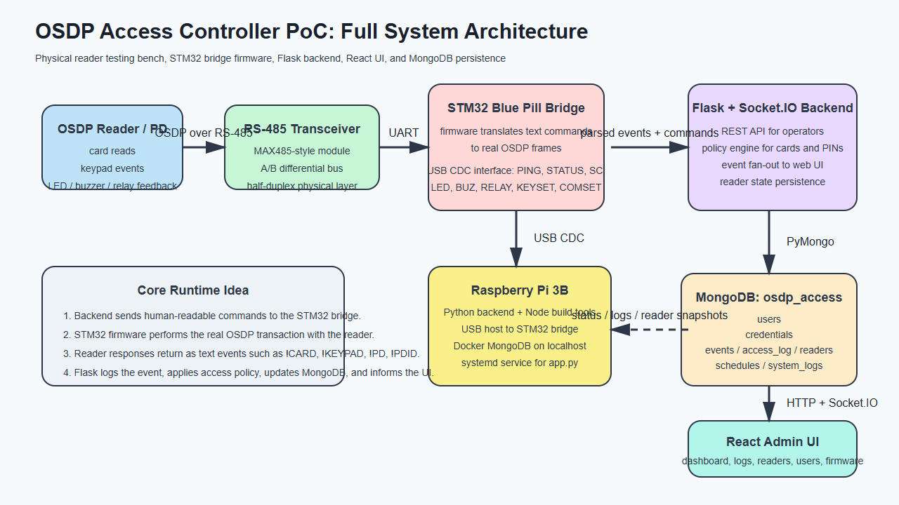
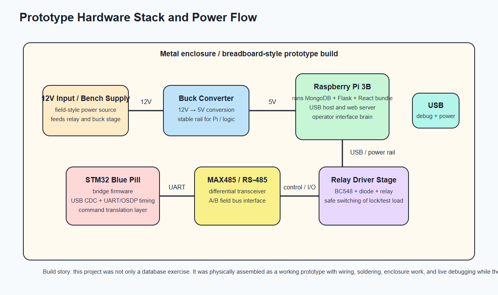
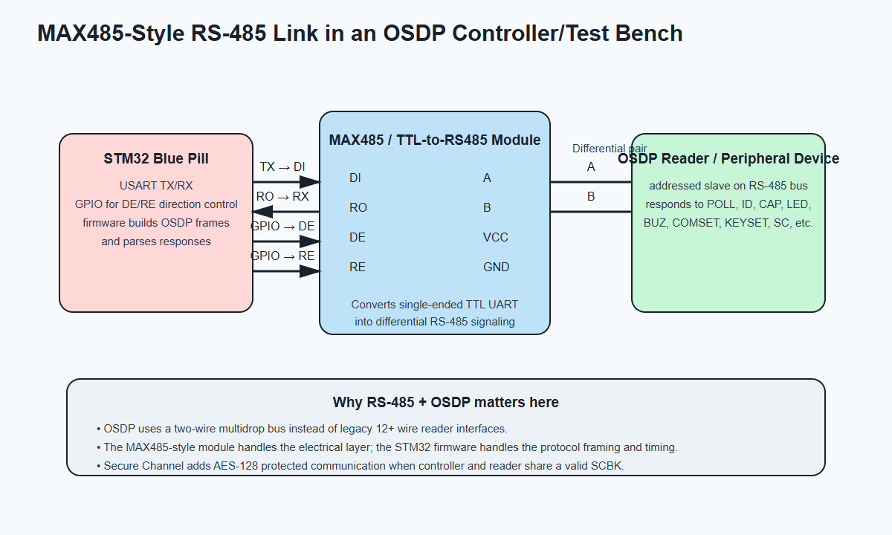
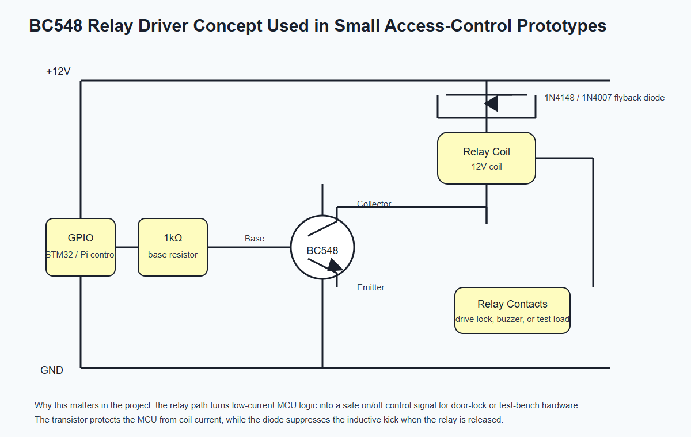
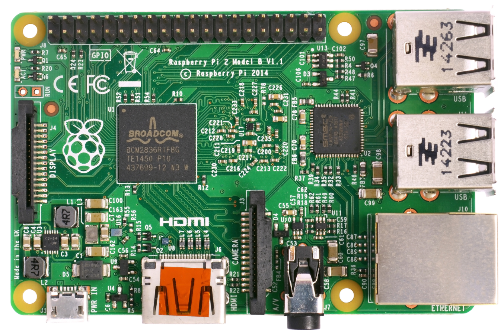
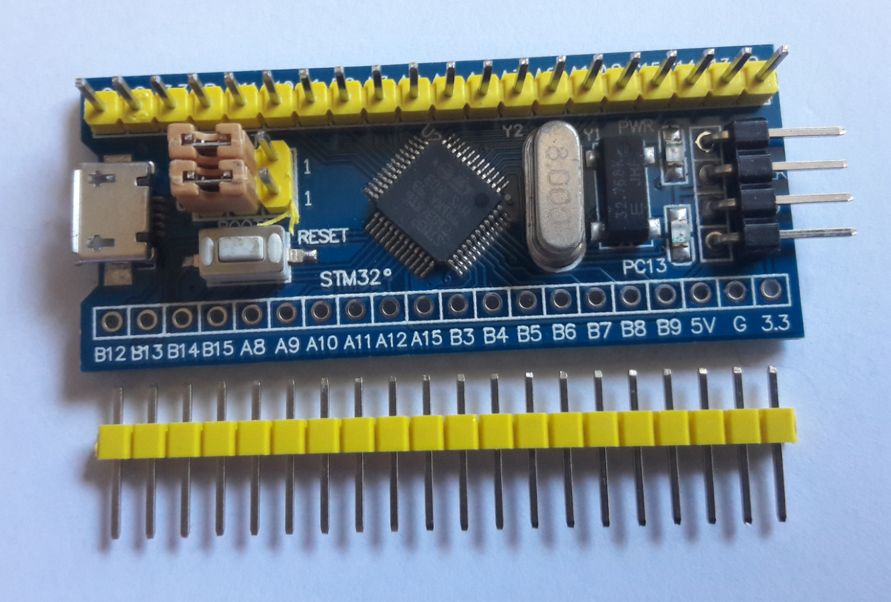
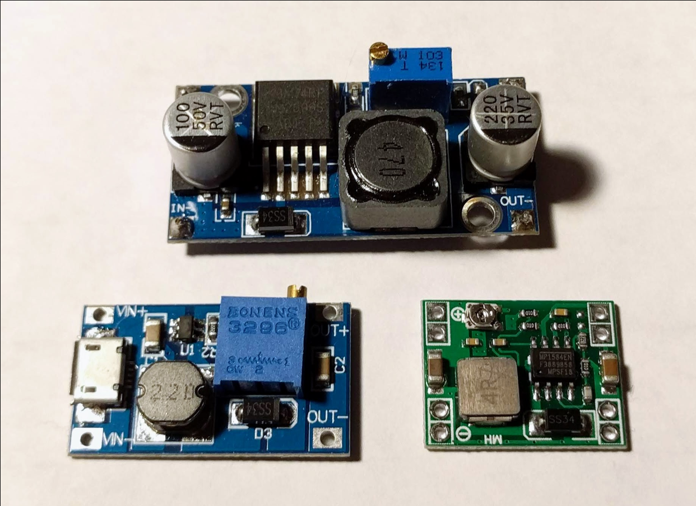

# Abstract

This project presents the design and implementation of a MongoDB-backed proof of concept for an OSDP access controller and reader test bench. The system combines a Raspberry Pi 3B, a custom STM32 Blue Pill bridge, an RS-485 physical layer, relay-driving hardware, a Flask and Socket.IO backend, a React operator interface, and a MongoDB database named `osdp_access`. The database stores users, credentials, schedules, reader state, raw events, access decisions, and system diagnostics.

This project is suitable for the Databases II course because it uses MongoDB as a real NoSQL database in a nontrivial hardware-software system. Rather than being a purely academic CRUD exercise, it grew out of a practical engineering need: building a flexible controller that could be used to test readers during firmware development. The database was designed in parallel with the physical prototype, the bridge firmware, and the backend and frontend software.

The report explains the project at three levels. First, it explains the access-control context, OSDP, and the physical prototype. Second, it explains the software architecture: STM32 bridge firmware behavior, backend API logic, frontend UI workflow, and Raspberry Pi deployment. Third, it explains the MongoDB data model in detail, including collections, document structure, indexing, embedding versus referencing decisions, representative queries, and backup and restore tooling. The report also includes annotated commands and code excerpts to show how the implementation works line by line.

Keywords: MongoDB, NoSQL, access control, OSDP, RS-485, STM32 Blue Pill, Raspberry Pi, PyMongo, audit logging, embedded systems

\newpage

# 1. Introduction

## 1.1 Background and Personal Motivation

The idea for this project came directly from practical engineering work. I work as a firmware engineer on access-control readers, and I needed a flexible controller-side tool that could help me test readers during development. Instead of treating the Databases II project as something separate from that work, I used it as an opportunity to build something practical while also approaching it as a database design problem.

At the same time, I was learning MongoDB and NoSQL data modeling. That made the project a useful setting for studying MongoDB through a controller platform instead of through a small isolated example. The project therefore became a combination of several parallel efforts:

1. building the physical prototype on a breadboard and inside an enclosure,
2. wiring and debugging the electronics,
3. developing and testing the STM32 bridge firmware,
4. designing the MongoDB schema,
5. implementing the Flask backend and React frontend,
6. deploying the final system on a Raspberry Pi.

This was not only a software exercise. The prototype was physically assembled over two very intense days of soldering, drilling, filing, wiring, flashing firmware, and debugging communication problems. That practical build process influenced the database design because the database had to support operational questions coming from the hardware and the test setup.

## 1.2 Problem Statement

An access-control reader is only one side of the system. To test a reader correctly, an engineer also needs a controller-side environment that can:

1. communicate over the correct field bus,
2. send and receive real protocol messages,
3. issue commands such as LED, buzzer, relay, identification, capability, and secure-channel requests,
4. record card and keypad events,
5. keep audit logs of access attempts,
6. provide a user interface for configuration and debugging,
7. persist data in a database that supports both administrative records and high-volume event logs.

The problem is that these requirements naturally mix structured administrative data and semi-structured operational data. Users, credentials, and schedules are relatively stable. Reader state changes frequently. Raw hardware events are heterogeneous and append-heavy. Diagnostic logs are useful during debugging but do not fit neatly into a fixed relational table set unless the schema becomes verbose and rigid.

This project addresses that problem by using MongoDB as the persistence layer for a real OSDP controller proof of concept.

## 1.3 Project Scope

The project includes:

1. a MongoDB database for access-control data and logs,
2. a Python backend built with Flask and Flask-SocketIO,
3. a React frontend for operators,
4. a thread-safe serial bridge client in Python,
5. a custom STM32 Blue Pill bridge firmware interface,
6. hardware deployment on Raspberry Pi,
7. backup and restore scripts,
8. firmware update support for the STM32 bridge,
9. source code for the STM32 bridge firmware and USB bootloader.

The project does not include:

1. enterprise identity management or LDAP integration,
2. production-grade clustered MongoDB deployment,
3. multiple site management or sharding,
4. biometric template storage,
5. cloud synchronization,
6. the proprietary reader firmware used during testing.

## 1.4 Objectives

The main objectives of this project are:

1. Design a MongoDB schema that matches the access patterns of an access-control controller.
2. Persist both stable administrative data and fast-changing field data.
3. Support card and PIN workflows with clear audit logging.
4. Track reader state separately from raw event history.
5. Build a controller test bench for OSDP reader development.
6. Connect embedded hardware work with a practical NoSQL database design.
7. Demonstrate deployment, backup, restore, and field testing.
8. Produce a course project report that explains both the database and the complete system around it.

## 1.5 Why This Project Belongs in Databases II

The Databases II project allows a MongoDB or other NoSQL topic. This project fits that requirement well because the database is central to the platform. MongoDB is not used as an afterthought. It is used to model:

1. users and credentials,
2. schedules and access policy,
3. reader state snapshots,
4. raw hardware events,
5. access decisions,
6. system diagnostics,
7. operational backup and restore.

The database design is driven by real runtime needs rather than hypothetical sample data. That makes the project a strong NoSQL case study.

# 2. Access Control and OSDP Context

## 2.1 What an Access Controller Does

In an access-control system, the reader is not the whole system. A reader is usually the field device placed near the door or gate. It reads a card, keypad input, or some other credential. The controller or control panel is the side that makes the final decision. It decides whether to grant or deny access, logs the attempt, and activates door hardware when needed.

Conceptually, the controller has four responsibilities:

1. communicate with one or more field devices,
2. know which users and credentials are valid,
3. apply business rules such as time schedules and allowed doors,
4. generate output actions such as unlock relay, LED patterns, and buzzer feedback.

This project implements that controller role as a proof of concept.

## 2.2 Why a Reader Test Controller Is Valuable

When developing access-control readers, it is often not enough to test them with a limited desktop tool or a protocol sniffer. A firmware engineer also needs a controller-side environment that behaves like a real panel. That means:

1. the reader can be polled,
2. secure channel can be attempted,
3. LED and buzzer commands can be observed,
4. keypad and card events can be captured,
5. reader identification and capabilities can be requested,
6. communication problems can be logged and analyzed.

The idea behind this project was therefore not only academic. It was driven by the practical need for a reusable test controller during reader firmware development.

## 2.3 What Is OSDP

The Open Supervised Device Protocol, or OSDP, is an access-control communication standard maintained by the Security Industry Association. The SIA describes OSDP as an open standard that improves interoperability among access-control and security products and supports secure-channel operation with AES-128 protection. OSDP is used between a control panel and peripheral devices such as readers.

In practical terms, OSDP gives the system several advantages over older one-way or lower-security interfaces:

1. bidirectional communication,
2. richer device control,
3. reader supervision and status reporting,
4. better interoperability,
5. secure channel support,
6. simpler field wiring through RS-485 multidrop communication.

{ width=55% }

As a supplementary visual reference during final documentation, I also used the Farpointe Data OSDP explainer page and white paper cover. That material is not part of the implementation itself, but it helped connect the report to the way OSDP is presented in current access-control industry practice.

## 2.4 OSDP Terms Used in This Project

Several OSDP terms appear throughout this project:

1. CP: Control Panel. In this project, the controller side is the Raspberry Pi plus the STM32 bridge.
2. PD: Peripheral Device. In this project, the reader under test is the PD.
3. RS-485: The differential physical layer used for field communication.
4. Secure Channel: The OSDP encryption and authentication mode.
5. SCBK: Secure Channel Base Key used to establish secure communication.
6. COMSET: A command used to change communication settings.
7. PDID and PDCAP: Identification and capability responses from the reader.

## 2.5 Why OSDP Instead of Legacy Wiegand-Style Thinking

OSDP is important because it supports real command and response behavior. A controller can ask the reader for identity, capabilities, or status. It can trigger LEDs, buzzers, and other functions. It can also attempt secure channel and supervise communication health. That makes OSDP much better for testing advanced reader behavior than a purely one-way credential output interface.

# 3. Full System Overview

## 3.1 System Architecture

The project is best understood as a full stack embedded-access-control system. The following figure shows the main runtime architecture.

{ width=95% }

The architecture has five major layers:

1. the reader under test,
2. the RS-485 electrical interface,
3. the STM32 Blue Pill bridge firmware,
4. the Raspberry Pi application stack,
5. the MongoDB database and browser UI.

The key idea is that Python does not generate raw OSDP frames directly. Instead, the STM32 firmware handles the field protocol and exposes a simpler text-based interface over USB CDC. The Flask backend sends commands such as `PING`, `STATUS`, `SC 0`, `LED 0 ...`, or `BUZ 0 ...`, and the STM32 bridge returns text events such as `!CARD`, `!KEYPAD`, `!PD`, and `!PDID`.

## 3.2 Hardware Stack and Prototype Build

The hardware prototype is built from a Raspberry Pi 3B, an STM32 Blue Pill board, RS-485 transceiver hardware, power conversion hardware, and a relay-driving stage.

{ width=95% }

The physical build process matters because the software was developed against the real prototype, not against a simulated environment. This affected many design decisions:

1. the backend had to survive USB reconnects,
2. the database had to persist unstable field events for debugging,
3. the Pi deployment script had to be practical on real ARM hardware,
4. power and signal wiring needed to be reflected in the system explanation.

## 3.3 RS-485 and MAX485-Style Interface

OSDP is usually carried over RS-485. In this project, a MAX485-style transceiver module converts the STM32 UART signals into the differential A/B bus used by the reader.

{ width=90% }

The RS-485 layer matters because it is where electrical communication becomes field communication. The STM32 firmware is responsible for:

1. controlling direction on the half-duplex bus,
2. formatting OSDP frames at the protocol level,
3. timing requests and responses correctly,
4. translating hardware results back into textual events for the Raspberry Pi.

## 3.4 Relay Driver Stage with BC548

Small embedded access-control prototypes often use a transistor stage to control a relay from logic-level outputs. The following figure shows the concept relevant to this project.

{ width=90% }

The relay driver stage exists because a microcontroller output pin cannot safely drive a relay coil directly. The transistor provides current gain, and the flyback diode protects the circuit from the voltage spike generated when the relay turns off.

## 3.5 Visual Reference Notes

I prepared the report using a combination of original technical diagrams and representative hardware reference photos. The relay, RS-485 path, prototype stack, and overall system architecture diagrams in this document are original. The embedded board and module photos are included as reference visuals for the classes of hardware used in the prototype. The following source pages were used for those reference images:

1. STM32 Blue Pill style board image reference: [Wikimedia Commons board photo](https://upload.wikimedia.org/wikipedia/commons/1/10/Core_Learning_Board_module_Arduino_STM32_F103_C8T6.jpg)
2. Buck converter module image reference: [Wikimedia Commons LM2596 module photo](https://upload.wikimedia.org/wikipedia/commons/6/66/LM2596_buck_converter_module%2C_MP1584_buck_converter_module%2C_and_SDB628_boost_converter_module.jpg)
3. Raspberry Pi family board image reference: [Wikimedia Commons Raspberry Pi board photo](https://upload.wikimedia.org/wikipedia/commons/3/31/Raspberry_Pi_2_Model_B_v1.1_top_new_%28bg_cut_out%29.jpg)
4. OSDP explainer and white paper reference: [Farpointe Data OSDP page](https://farpointedata.com/osdp/)

The deployed system itself uses a Raspberry Pi 3B. The embedded Raspberry Pi image below is a representative family board photo rather than the exact photographed unit used in the prototype.

# 4. Hardware and Firmware Design

## 4.1 Raspberry Pi 3B Role

The Raspberry Pi 3B is the main application computer in the prototype. It runs:

1. the Python backend,
2. the built React frontend,
3. the MongoDB database in Docker,
4. the systemd service used for automatic startup.

{ width=72% }

The Raspberry Pi was a useful choice because it is inexpensive, physically small, Linux-based, and realistic for a controller proof of concept.

## 4.2 STM32 Blue Pill Role

The STM32 Blue Pill acts as the protocol bridge. Its job is to sit between the Raspberry Pi and the reader and translate between two worlds:

1. the Raspberry Pi speaks high-level ASCII commands over USB CDC,
2. the reader speaks OSDP over RS-485.

{ width=78% }

This design keeps the Python backend simpler. Instead of making Python deal with low-level frame timing and bus direction switching, those responsibilities stay inside the embedded firmware.

## 4.3 What the Repository Firmware and Python Code Reveal About Bridge Behavior

The repository now includes the STM32 bridge firmware source under [osdp-controller/src/main.cpp](https://github.com/evilcomputer12/osdp-acess-controller-poc-public/blob/main/osdp-controller/src/main.cpp) and [osdp-controller/src/osdp_cp.cpp](https://github.com/evilcomputer12/osdp-acess-controller-poc-public/blob/main/osdp-controller/src/osdp_cp.cpp), together with the USB bootloader under [bootloader/src/main.cpp](https://github.com/evilcomputer12/osdp-acess-controller-poc-public/blob/main/bootloader/src/main.cpp). The Python bridge client in [bridge.py](https://github.com/evilcomputer12/osdp-acess-controller-poc-public/blob/main/bridge.py) still provides the clearest host-side view of how the backend talks to the MCU. The backend sends commands such as:

1. `PING`
2. `STATUS`
3. `ID <idx>`
4. `CAP <idx>`
5. `LSTAT <idx>`
6. `SC <idx>`
7. `KEYSET <idx> <key>`
8. `LED <idx> ...`
9. `BUZ <idx> ...`
10. `RELAY <idx> ...`

The bridge then emits text events such as:

1. `!CARD`
2. `!KEYPAD`
3. `!STATE`
4. `!PD`
5. `!PDID`
6. `!PDCAP`
7. `!LSTAT`
8. `!NAK`
9. `!COM`

This already tells us the firmware has three major responsibilities:

1. implement transport between USB CDC and RS-485,
2. translate controller requests into OSDP operations,
3. normalize reader responses into line-oriented textual events.

## 4.4 Firmware Update Path

The project also supports firmware updating of the STM32 bridge through [flasher.py](https://github.com/evilcomputer12/osdp-acess-controller-poc-public/blob/main/flasher.py). The flashing logic reveals that the Blue Pill has a custom bootloader workflow:

1. the application firmware can be asked to reboot into bootloader mode,
2. the bootloader enumerates on a different USB PID,
3. the host uploads firmware in small chunks,
4. the bootloader erases flash, writes the new image, verifies CRC-32, and boots the application.

That is a useful engineering feature because the controller prototype can be updated and improved without additional dedicated hardware every time.

## 4.5 Power Path and Buck Converter

The buck converter is important because the prototype combines different voltage domains. A field-style power input such as 12V is common in access control, but the Raspberry Pi and logic circuits typically require 5V. A buck converter therefore steps the voltage down efficiently. Without that stage, the Pi cannot be powered reliably from the field-side supply.

{ width=58% }

## 4.6 Relay Path and Test-Bench Outputs

The relay stage matters because access-control systems ultimately need to switch something in the physical world, such as a lock, strike, buzzer, or test load. Even in a test bench, this means the system can be evaluated with a physical output path rather than only as a passive logger.

## 4.7 Engineering Reality of the Prototype

This part of the project was not only a database exercise, because the hardware and database evolved together during implementation. While building the box, wiring the boards, and dealing with USB, power, and serial problems, the design also had to address:

1. what should be logged permanently,
2. what belongs in raw event history versus current reader state,
3. how to record denied-access reasons clearly,
4. how to back up the system for redeployment,
5. how to expose the system to a frontend without losing field context.

# 5. Backend and Frontend Architecture

## 5.1 Backend Overview

The backend is implemented in [app.py](https://github.com/evilcomputer12/osdp-acess-controller-poc-public/blob/main/app.py). It uses Flask for REST endpoints and Flask-SocketIO for real-time updates to the frontend. The backend has several responsibilities:

1. connect to MongoDB,
2. authenticate web-panel operators through session-based login,
2. connect to the serial bridge,
3. receive events from the STM32,
4. persist important events in MongoDB,
5. apply access policy for cards and PINs,
6. issue reader feedback commands,
7. enforce admin-only write operations while allowing a read-only demo session,
8. serve the built frontend.

The code currently exposes more than forty API routes, including routes for users, credentials, schedules, events, system logs, reader commands, firmware actions, and panel authentication.

## 5.2 Event Processing Strategy

One of the most important backend design decisions is the use of an event queue between the serial thread and the business-logic path. The bridge thread pushes events into a queue, and a worker thread processes them. This matters because field communication can be bursty, and the database or UI layer must not block the serial read loop.

## 5.3 Access Decision Path

When a card arrives, the backend performs the following logic:

1. persist the raw card event in `events`,
2. check whether enrollment mode is active,
3. if not enrolling, look up the card in `credentials`,
4. load the referenced user from `users`,
5. evaluate active state, allowed readers, and schedule,
6. write a result to `access_log`,
7. command relay, LED, and buzzer feedback.

The same policy idea applies to PINs, except the digits first pass through a small keypad accumulation buffer before the final credential lookup.

## 5.4 Reader State Tracking

The backend separates historical event logging from current reader state. Instead of reading the current state from the raw event stream every time, the application keeps the `readers` collection updated via upserts. This makes the dashboard and diagnostics pages much faster and easier to implement.

## 5.5 Frontend Overview

The frontend is built with React and Vite. [frontend/src/App.jsx](https://github.com/evilcomputer12/osdp-acess-controller-poc-public/blob/main/frontend/src/App.jsx) shows the top-level navigation and the real-time socket listeners. The interface includes pages for:

1. Dashboard
2. Readers
3. Users
4. Enrollment
5. Schedules
6. Events
7. Access Log
8. Reader Config
9. Comms Monitor
10. System Logs
11. Terminal
12. Firmware Update

The panel now starts with a login screen and two seeded web accounts. `admin / osdp` has full control of the system, while `demo / db2` is restricted to a read-only activity view intended for course demonstration and teacher access. For better operational hygiene, the frontend no longer exposes preset buttons or inline default credentials, and the admin Users page can now either rotate a panel password or reset a seeded account back to its default. This also shows that the database is part of a working management interface rather than a standalone schema.

# 6. MongoDB Database Design

## 6.1 Why MongoDB Was the Right Fit

MongoDB was a good choice for this project for several reasons.

First, the project stores different types of data with different stability and structure. User documents are stable and predictable. Credentials are slightly more varied. Schedules include embedded arrays. Raw events are heterogeneous. Diagnostic logs can contain optional fields. MongoDB handles this mixture naturally.

Second, MongoDB makes it easy to model data according to access patterns. The official MongoDB modeling guidance emphasizes that data accessed together should be stored together and that embedding or referencing should be chosen according to application behavior. That matches this project well.

Third, the project was evolving quickly while the prototype was being built. A flexible document model helped me iterate without constantly rewriting a rigid schema and migration logic.

## 6.2 Database Name and Collections

The database is called `osdp_access`. The main collections are:

1. `users`
2. `panel_users`
3. `credentials`
4. `events`
5. `access_log`
6. `readers`
7. `schedules`
8. `system_logs`

The model layer is implemented in [models.py](https://github.com/evilcomputer12/osdp-acess-controller-poc-public/blob/main/models.py).

## 6.3 Collection Responsibilities

### `users`

Stores each person or operator in the system. Important fields include username, full name, role, active flag, allowed readers, schedule name, and creation timestamp.

### `panel_users`

Stores the web-panel login accounts separately from access-control identities. This collection currently seeds two fixed operator accounts: `admin` with role `admin`, and `demo` with role `viewer`. Keeping this collection separate avoids mixing UI operators with cardholders, PIN users, and access schedules. The application now lets an admin either change one of these panel passwords directly or reset a seeded panel account back to its repository default without recreating the document.

### `credentials`

Stores both card and PIN credentials. A credential references a user by `user_id`. This collection uses references rather than embedding because users can have multiple credentials with independent lifecycles.

### `schedules`

Stores named schedules such as `24/7` and `Weekdays 8-18`. The schedule periods are embedded because they are small, bounded, and always accessed together.

### `readers`

Stores the latest state of each reader. This includes online/offline information, secure-channel state, tamper, power, and identification data.

### `events`

Stores raw or normalized hardware events. This collection is intentionally flexible because different event types have different fields.

### `access_log`

Stores the final result of access-control decisions and their reasons. This is the key audit collection for understanding why access was granted or denied.

### `system_logs`

Stores internal diagnostics. This is particularly useful while debugging the prototype, deploying on Raspberry Pi, or tracking serial communication issues.

## 6.4 Sample Documents

### User Document

```json
{
  "_id": {"$oid": "665f00000000000000000001"},
  "username": "martin",
  "full_name": "Martin Velichkovski",
  "role": "admin",
  "active": true,
  "allowed_readers": [0],
  "schedule": "24/7",
  "created": {"$date": "2026-05-09T10:00:00Z"}
}
```

### Credential Document

```json
{
  "_id": {"$oid": "665f00000000000000000010"},
  "user_id": {"$oid": "665f00000000000000000001"},
  "type": "card",
  "card_hex": "04A1B2C3D4",
  "card_dec": "19938448340",
  "bits": 34,
  "format": 0,
  "reader": 0,
  "enrolled": {"$date": "2026-05-09T10:03:00Z"},
  "active": true
}
```

### Schedule Document

```json
{
  "_id": {"$oid": "665f00000000000000000020"},
  "name": "Weekdays 8-18",
  "periods": [
    {"days": [0, 1, 2, 3, 4], "start": "08:00", "end": "18:00"}
  ]
}
```

### Reader Document

```json
{
  "_id": {"$oid": "665f00000000000000000030"},
  "index": 0,
  "addr": 0,
  "state": "ONLINE",
  "sc": 0,
  "tamper": 0,
  "power": 0,
  "vendor": "E41E0A",
  "model": 1,
  "serial": "21AA0145",
  "firmware": "2.83.0",
  "last_seen": {"$date": "2026-05-09T10:15:00Z"}
}
```

### Access Log Document

```json
{
  "_id": {"$oid": "665f00000000000000000040"},
  "ts": {"$date": "2026-05-09T10:20:00Z"},
  "card_hex": "04A1B2C3D4",
  "user_id": {"$oid": "665f00000000000000000001"},
  "username": "martin",
  "granted": true,
  "reader": 0,
  "reason": "credential matched and schedule allowed"
}
```

## 6.5 Index Strategy

The index strategy in [models.py](https://github.com/evilcomputer12/osdp-acess-controller-poc-public/blob/main/models.py) is simple but important.

| Collection | Index | Purpose |
| --- | --- | --- |
| `users` | `username` unique | Prevent duplicates and support quick lookup |
| `panel_users` | `username` unique | Unique web-panel login names |
| `credentials` | `user_id` | List credentials for one user |
| `credentials` | `card_hex` | Fast card lookup during access |
| `events` | `ts` descending | Efficient recent-event queries |
| `access_log` | `ts` descending | Efficient recent audit queries |
| `readers` | `index` unique | Exactly one reader snapshot per index |
| `schedules` | `name` unique | Schedule reuse by name |
| `system_logs` | `ts` descending | Efficient recent diagnostic queries |

## 6.6 Embedding Versus Referencing

The project uses both patterns.

Embedding is used for:

1. `allowed_readers` inside a user document,
2. `periods` inside a schedule document.

Referencing is used for:

1. `credentials.user_id -> users._id`

The rationale is straightforward:

1. schedules and reader lists are small and naturally belong with the parent record,
2. credentials are independent objects that can be created, revoked, queried, and filtered separately.

## 6.7 Business Rules Enforced by the Application

The application currently enforces the following important rules:

1. usernames must be unique,
2. panel usernames must be unique,
3. schedule names must be unique,
4. readers are uniquely identified by numeric index,
5. disabled users cannot gain access,
6. the `demo` web account is read-only,
7. admin panel writes require the `admin` web role,
8. users with empty `allowed_readers` are allowed on all readers,
9. users with a non-empty list are restricted to those readers,
10. schedules gate access according to current time,
11. raw event history is append oriented,
12. access results are append oriented,
13. reader state is maintained by upsert rather than append-only logging.

## 6.8 Mongo Shell Representation of the Same Model

Although the main application uses Python and PyMongo, the same database model is also expressed directly in native MongoDB shell syntax through [scripts/osdp_access_mongo.js](https://github.com/evilcomputer12/osdp-acess-controller-poc-public/blob/main/scripts/osdp_access_mongo.js). From a database-course perspective, this shows that the schema and business-oriented data operations are not tied to one application framework. The core model can also be presented directly through `mongosh` methods such as `createCollection()`, `createIndex()`, `insertOne()`, `findOne()`, `updateOne()`, `deleteOne()`, and `deleteMany()`.

This shell implementation follows the same collection structure described above: `users`, `panel_users`, `credentials`, `events`, `access_log`, `readers`, `schedules`, and `system_logs`. It also seeds the same default schedules, adds the same fixed `admin` and `demo` panel accounts, includes reset helpers for restoring seeded panel passwords, applies the same lookup rules for cards and PINs, and keeps the same distinction between current reader state and append-only operational logs. In other words, the Mongo shell version is not a separate design; it is a direct representation of the same database model in Mongo-native syntax.

For demonstration purposes, the project also includes [scripts/osdp_access_mongo_demo.js](https://github.com/evilcomputer12/osdp-acess-controller-poc-public/blob/main/scripts/osdp_access_mongo_demo.js), which runs the helper library against a separate database named `osdp_access_demo`. That allows the project to demonstrate schema creation, CRUD operations, schedule checks, event logging, access evaluation, and audit-log generation without modifying the live application database. The full explanation and the full captured run output are included directly in Appendix E and Appendix F of this report, based on [docs/MONGO_SCRIPT_WALKTHROUGH.md](https://github.com/evilcomputer12/osdp-acess-controller-poc-public/blob/main/docs/MONGO_SCRIPT_WALKTHROUGH.md) and [docs/MONGO_SCRIPT_DEMO_OUTPUT.txt](https://github.com/evilcomputer12/osdp-acess-controller-poc-public/blob/main/docs/MONGO_SCRIPT_DEMO_OUTPUT.txt).

This connects the conceptual model, the application implementation, and the native MongoDB shell operations in one place. A reader can therefore understand the project at three levels:

1. as a document-model design,
2. as an application-backed MongoDB implementation,
3. as a Mongo shell demonstration of the same schema and logic.

# 7. Implementation Walkthrough with Commands and Code

## 7.1 Local Development Commands and What They Mean

### Create a virtual environment

```bash
python -m venv .venv
```

Explanation:

1. `python` starts the Python interpreter.
2. `-m venv` tells Python to run the standard-library virtual environment module.
3. `.venv` is the directory where the isolated environment is created.

### Install backend dependencies

```bash
.venv/bin/pip install -r requirements.txt
```

Explanation:

1. `.venv/bin/pip` uses the package installer from the project-specific environment.
2. `install` tells pip to install packages.
3. `-r requirements.txt` reads the package list from the requirements file.

### Build the React frontend

```bash
cd frontend
npm ci
npm run build
```

Explanation:

1. `cd frontend` enters the frontend project directory.
2. `npm ci` installs exactly the versions recorded in `package-lock.json`.
3. `npm run build` executes the Vite production build and outputs the files into `static/dist`.

### Run the backend

```bash
cd ..
.venv/bin/python app.py
```

Explanation:

1. `cd ..` returns to the repository root.
2. `.venv/bin/python` uses the Python interpreter from the virtual environment.
3. `app.py` starts the Flask and Socket.IO backend.

After the backend starts, the web panel now requires login. The two seeded accounts are:

1. `admin / osdp` for full control,
2. `demo / db2` for a read-only viewer session intended for demonstrations.

For better security, the frontend does not reveal those defaults on the login screen anymore. If the passwords were rotated earlier, an admin can restore them either from the Users page or through the Mongo shell helpers before a demonstration.

For temporary off-site access, the repository also includes [share-ngrok.ps1](https://github.com/evilcomputer12/osdp-acess-controller-poc-public/blob/main/share-ngrok.ps1), which starts `ngrok http 5000` and prints a public HTTPS URL for the local panel. That makes it possible to demonstrate the dashboard and live logs safely through the `demo` account without exposing write operations.

## 7.2 Raspberry Pi Deployment Command and Line-by-Line Meaning

The most important deployment command is the Docker run used for MongoDB.

```bash
docker run -d \
  --name osdp-access-mongo \
  --restart unless-stopped \
  -p 127.0.0.1:27017:27017 \
  -v /home/admin/osdp-access-mongo:/data/db \
  mongo:4.4.18
```

Explanation:

1. `docker run` creates and starts a new container.
2. `-d` starts it in detached background mode.
3. `--name osdp-access-mongo` gives the container a stable name.
4. `--restart unless-stopped` makes it restart automatically after reboot unless explicitly stopped.
5. `-p 127.0.0.1:27017:27017` binds MongoDB only to localhost on the Pi for safer local-only access.
6. `-v /home/admin/osdp-access-mongo:/data/db` stores MongoDB data persistently on the Pi filesystem.
7. `mongo:4.4.18` chooses the MongoDB image tag.

That version choice matters. During deployment, newer MongoDB images failed on the target Pi because of ARM CPU feature requirements, so the setup was pinned to a compatible version.

## 7.3 Backup and Restore Commands and What They Mean

### Backup

```bash
python backup_mongo.py --mongo-uri mongodb://localhost:27017 --db osdp_access --output-dir backups
```

Explanation:

1. `python backup_mongo.py` runs the backup tool.
2. `--mongo-uri mongodb://localhost:27017` tells the script where MongoDB is running.
3. `--db osdp_access` selects the database to export.
4. `--output-dir backups` selects the root folder where the timestamped backup directory will be created.

### Restore

```bash
python restore_mongo.py backups/mongodb_osdp_access_YYYYMMDD_HHMMSS --mongo-uri mongodb://localhost:27017
```

Explanation:

1. `python restore_mongo.py` runs the restore tool.
2. `backups/...` is the specific backup directory that contains `manifest.json` and collection dumps.
3. `--mongo-uri ...` points to the target MongoDB instance.

## 7.4 Annotated Code Example: MongoDB Initialization

The following excerpt from [models.py](https://github.com/evilcomputer12/osdp-acess-controller-poc-public/blob/main/models.py) is the entry point into the database layer.

```python
def get_db(uri="mongodb://localhost:27017"):
    client = MongoClient(uri, serverSelectionTimeoutMS=3000)
    db = client[DB_NAME]
    _ensure_indexes(db)
    return db
```

Line-by-line explanation:

1. `def get_db(...):` defines a helper that returns the database handle used everywhere else.
2. `uri="mongodb://localhost:27017"` provides a default local MongoDB address.
3. `MongoClient(uri, serverSelectionTimeoutMS=3000)` creates the MongoDB client and fails quickly if the database is not reachable.
4. `db = client[DB_NAME]` selects the `osdp_access` database.
5. `_ensure_indexes(db)` creates indexes and default schedules automatically.
6. `return db` gives the caller a ready-to-use database handle.

The initialization logic continues with `_ensure_indexes()`:

```python
def _ensure_indexes(db):
    db.users.create_index("username", unique=True)
  db.panel_users.create_index("username", unique=True)
    db.credentials.create_index("user_id")
    db.credentials.create_index("card_hex")
    db.events.create_index([("ts", DESCENDING)])
    db.access_log.create_index([("ts", DESCENDING)])
    db.readers.create_index("index", unique=True)
    db.schedules.create_index("name", unique=True)
    db.system_logs.create_index([("ts", DESCENDING)])
```

Line-by-line explanation:

1. `db.users.create_index("username", unique=True)` prevents duplicate usernames.
2. `db.panel_users.create_index("username", unique=True)` prevents duplicate login names for the web panel.
3. `db.credentials.create_index("user_id")` accelerates queries for all credentials of one user.
4. `db.credentials.create_index("card_hex")` makes card lookups fast during access decisions.
5. `db.events.create_index([("ts", DESCENDING)])` makes recent-event pages efficient.
6. `db.access_log.create_index([("ts", DESCENDING)])` makes audit-log pages efficient.
7. `db.readers.create_index("index", unique=True)` ensures one state document per reader.
8. `db.schedules.create_index("name", unique=True)` prevents duplicate schedule names.
9. `db.system_logs.create_index([("ts", DESCENDING)])` supports recent diagnostic log queries.

## 7.5 Annotated Code Example: Serial Bridge Connection

The bridge connection logic in [bridge.py](https://github.com/evilcomputer12/osdp-acess-controller-poc-public/blob/main/bridge.py) is one of the most important pieces of the project.

```python
def connect(self, port=None, retries=3):
    if self.ser and self.ser.is_open and self.connected:
        return True
    self._cleanup()
    port = port or self.find_port()
    if not port:
        log.warning("No Blue Pill port found")
        return False
```

Line-by-line explanation:

1. `connect(..., retries=3)` attempts to open the bridge with automatic retries.
2. The first `if` avoids reconnecting if the bridge is already usable.
3. `self._cleanup()` clears stale serial state before a new attempt.
4. `port = port or self.find_port()` uses the explicitly provided port or auto-detects the Blue Pill by USB VID and PID.
5. If no port is found, the method logs a warning and returns `False`.

This is important because real USB hardware is unreliable in the field: ports disappear, reconnect, or enumerate differently after reboot.

## 7.6 Annotated Code Example: Parsing Bridge Events

The bridge converts raw lines from the STM32 into structured Python dictionaries. A representative example is the card event parser.

```python
m = re.match(r"!CARD (\d+) ([0-9A-Fa-f]+) (\d+) (\d+)", line)
if m:
    return {
        "type": "card",
        "reader": int(m.group(1)),
        "hex": m.group(2),
        "bits": int(m.group(3)),
        "format": int(m.group(4)),
        "ts": ts,
        "raw": line,
    }
```

Line-by-line explanation:

1. `re.match(...)` looks for a line beginning with `!CARD` followed by reader number, card hex value, bit length, and format.
2. `if m:` means the parser only continues if the pattern matched.
3. `"type": "card"` normalizes the event into an internal event type.
4. `"reader": int(...)` records which reader generated the card event.
5. `"hex": ...` stores the raw credential value used for lookup or enrollment.
6. `"bits": ...` preserves bit length metadata.
7. `"format": ...` preserves format metadata.
8. `"ts": ts` records a backend-side timestamp.
9. `"raw": line` preserves the original line for diagnostics.

This is a good example of why MongoDB fits the project: different event types naturally carry different fields, and a flexible document model stores them without a complicated rigid schema.

## 7.7 Annotated Code Example: Card Access Decision

The access-policy path in [app.py](https://github.com/evilcomputer12/osdp-acess-controller-poc-public/blob/main/app.py) is central to the controller logic.

```python
cred = find_credential_by_card(db, ev["hex"])
if cred:
    user = get_user(db, str(cred["user_id"]))
    name = user["username"] if user else "unknown"
    allowed, reason = _check_access_policy(user, reader) if user else (False, "user not found")
    if allowed:
        log_access(db, card_hex=ev["hex"], user_id=str(cred["user_id"]), username=name,
                   granted=True, reader=reader, reason=reason)
        bridge.relay(reader, "T1500")
        bridge.grant_feedback(reader)
```

Line-by-line explanation:

1. `find_credential_by_card(...)` looks up the presented card in MongoDB.
2. `if cred:` continues only if the card exists and is active.
3. `get_user(...)` loads the user referenced by the credential.
4. `name = ...` safely produces a display name even if the user is missing.
5. `_check_access_policy(...)` applies business rules such as active state, allowed readers, and schedule.
6. `log_access(...)` writes the final audit record into `access_log`.
7. `bridge.relay(...)` activates the relay for a timed pulse.
8. `bridge.grant_feedback(...)` turns that decision into LED and buzzer behavior at the reader.

This short code path demonstrates the whole idea of the project: field input becomes database lookup, policy evaluation, audit logging, and real physical output.

## 7.8 Annotated Code Example: Firmware Flashing

The STM32 flasher in [flasher.py](https://github.com/evilcomputer12/osdp-acess-controller-poc-public/blob/main/flasher.py) is a good example of tooling around the hardware platform.

```python
resp = _send_cmd(ser, "ERASE", timeout=30)
if resp != "OK":
    raise RuntimeError(f"Erase failed: {resp}")

for i in range(total_chunks):
    offset = i * CHUNK_SIZE
    chunk = fw_data[offset : offset + CHUNK_SIZE]
    offset_hex = f"{offset:05X}"
    data_hex = chunk.hex().upper()
    cmd = f"W{offset_hex} {data_hex}"
    resp = _send_cmd(ser, cmd, timeout=5)
```

Line-by-line explanation:

1. `_send_cmd(ser, "ERASE", timeout=30)` instructs the bootloader to erase the application flash region.
2. `if resp != "OK":` checks that the bootloader acknowledged the command.
3. `for i in range(total_chunks):` starts chunked upload of the firmware image.
4. `offset = i * CHUNK_SIZE` computes the byte offset for each block.
5. `chunk = ...` slices the firmware bytes for the current block.
6. `offset_hex = ...` converts the offset into the format expected by the bootloader.
7. `data_hex = chunk.hex().upper()` converts binary bytes into ASCII hex.
8. `cmd = f"W{offset_hex} {data_hex}"` builds the bootloader write command.
9. `_send_cmd(...)` sends the write operation and waits for confirmation.

This tool makes the hardware platform maintainable and is an important part of the engineering completeness of the project.

## 7.9 Annotated Raspberry Pi Setup Script

The Raspberry Pi deployment script in [scripts/setup_raspberry_pi.sh](https://github.com/evilcomputer12/osdp-acess-controller-poc-public/blob/main/scripts/setup_raspberry_pi.sh) is worth understanding because it turns the project into a reproducible platform.

```bash
ROOT="$(cd "$(dirname "${BASH_SOURCE[0]}")/.." && pwd)"
MONGO_URI="${MONGO_URI:-mongodb://localhost:27017}"
MONGO_IMAGE="${MONGO_IMAGE:-mongo:4.4.18}"
```

Line-by-line explanation:

1. `ROOT=...` computes the repository root directory automatically.
2. `MONGO_URI=...` defines the MongoDB connection string, with a default value if none is provided.
3. `MONGO_IMAGE=...` allows the script to override the Docker image while defaulting to a Pi-compatible tag.

Later in the script, the database container is created, the Python environment is prepared, the frontend is built, and the app is registered as a systemd service. That makes the deployment path self-documenting and repeatable.

# 8. Representative MongoDB Queries and Reports

## 8.1 Find All Active Users

```javascript
db.users.find(
  { active: true },
  { username: 1, full_name: 1, role: 1, schedule: 1 }
).sort({ username: 1 })
```

This query retrieves currently active users, sorted alphabetically.

## 8.2 Find Credentials for a Specific User

```javascript
db.credentials.find({
  user_id: ObjectId("665f00000000000000000001"),
  active: true
}).sort({ enrolled: -1 })
```

This query is useful in the UI when reviewing or revoking user credentials.

## 8.3 Retrieve the Latest Reader State

```javascript
db.readers.find().sort({ index: 1 })
```

This query feeds the reader dashboard with current state snapshots instead of parsing the whole event history.

## 8.4 Count Events by Type

```javascript
db.events.aggregate([
  { $group: { _id: "$type", count: { $sum: 1 } } },
  { $sort: { count: -1 } }
])
```

This query is useful when analyzing whether the system is mostly seeing card traffic, keypad traffic, status updates, or configuration events.

## 8.5 Count Denied Access Reasons

```javascript
db.access_log.aggregate([
  { $match: { granted: false } },
  { $group: { _id: "$reason", count: { $sum: 1 } } },
  { $sort: { count: -1 } }
])
```

This query is valuable operationally because it explains why the system is denying access: disabled users, outside schedule, reader not allowed, unknown card, or unknown PIN.

## 8.6 Count Access Attempts Per Reader

```javascript
db.access_log.aggregate([
  { $group: { _id: "$reader", attempts: { $sum: 1 } } },
  { $sort: { attempts: -1 } }
])
```

This query helps analyze which reader is most active on the test bench or in future multi-reader deployments.

# 9. Deployment, Testing, and Development Story

## 9.1 Local Validation

The project was validated locally through:

1. backend startup tests,
2. login and role enforcement tests for `admin` and `demo`,
2. reader connection tests,
3. interactive OSDP workflow tests,
4. MongoDB backup generation,
5. MongoDB restore validation,
6. frontend build validation,
7. temporary public exposure through an ngrok tunnel for read-only review.

## 9.2 Raspberry Pi Deployment

The project was also deployed on a Raspberry Pi. This was important because it moved the project from a desktop development setup into a more controller-like environment.

During deployment, two real engineering issues appeared:

1. newer MongoDB container images were incompatible with the Pi CPU,
2. Flask-SocketIO required explicit `allow_unsafe_werkzeug=True` for the current deployment approach.

Those issues were fixed, documented, and folded back into the repository. That is a strong example of why real-world database work is inseparable from deployment and operations.

## 9.3 Current Working Result

At the time of writing:

1. the system runs on the Pi,
2. MongoDB is running in Docker,
3. the frontend is served successfully,
4. the backend responds on HTTP,
5. the bridge connects to the STM32,
6. the reader is visible and reporting status,
7. data backup and restore work.

## 9.4 Personal Engineering Reflection

This project became more than a database assignment because the database work was learned and applied in parallel with hardware assembly and embedded debugging. That made the process more demanding, but it also made the results easier to evaluate in a practical way. Instead of studying NoSQL concepts only in theory, I applied them while building a physical controller, wiring boards, debugging reader communication, and developing a tool that is useful in my day-to-day engineering context.

That is also why the project reflects real engineering constraints. It was built under time pressure, with physical hardware, firmware iteration, Linux deployment issues, database modeling decisions, and the need to keep all parts of the system working together.

# 10. Conclusion

This project demonstrates a practical MongoDB application in the domain of access control and embedded systems. The OSDP Access Controller PoC is not only a database model; it is a complete hardware-software platform that uses MongoDB as its operational memory, audit trail, and administrative data store.

The project also shows why MongoDB was a good choice. The system needed to store stable administrative documents, append-heavy event logs, flexible device telemetry, and diagnostic records. MongoDB handles this combination naturally. The final schema is easy to extend, easy to query, and aligned with the access patterns of the application.

From an educational perspective, the project demonstrates what a Databases II project should aim for: using a NoSQL database in a meaningful context, applying design ideas such as embedding versus referencing and index planning, implementing queries and data operations in code, and connecting the database to a real application stack. From an engineering perspective, it also produced a useful controller test platform for reader development.

Future work could include formal MongoDB schema validation, richer aggregation dashboards, multi-reader topologies, long-term log archival, and a more production-grade WSGI or ASGI deployment path. Even in its current form, however, the project already functions as both an academic NoSQL project and a practical engineering tool.

# 11. References

1. Security Industry Association. "Open Supervised Device Protocol (OSDP)." https://www.securityindustry.org/industry-standards/open-supervised-device-protocol/
2. MongoDB Documentation. "Data Modeling in MongoDB." https://www.mongodb.com/docs/manual/core/data-model-design/
3. PyMongo Documentation. https://pymongo.readthedocs.io/
4. Flask-SocketIO Documentation. https://flask-socketio.readthedocs.io/
5. pySerial Documentation. https://pyserial.readthedocs.io/
6. [README.md](https://github.com/evilcomputer12/osdp-acess-controller-poc-public/blob/main/README.md), repository overview and deployment notes.
7. [docs/PROTOCOL.md](https://github.com/evilcomputer12/osdp-acess-controller-poc-public/blob/main/docs/PROTOCOL.md), OSDP protocol and project flow notes.
8. [models.py](https://github.com/evilcomputer12/osdp-acess-controller-poc-public/blob/main/models.py), MongoDB model implementation.
9. [bridge.py](https://github.com/evilcomputer12/osdp-acess-controller-poc-public/blob/main/bridge.py), USB bridge client and event parser.
10. [app.py](https://github.com/evilcomputer12/osdp-acess-controller-poc-public/blob/main/app.py), backend API and access policy implementation.
11. [flasher.py](https://github.com/evilcomputer12/osdp-acess-controller-poc-public/blob/main/flasher.py), STM32 firmware flashing tool.
12. [scripts/setup_raspberry_pi.sh](https://github.com/evilcomputer12/osdp-acess-controller-poc-public/blob/main/scripts/setup_raspberry_pi.sh), Raspberry Pi deployment workflow.
13. [osdp-controller/src/main.cpp](https://github.com/evilcomputer12/osdp-acess-controller-poc-public/blob/main/osdp-controller/src/main.cpp), STM32 bridge application entrypoint.
14. [bootloader/src/main.cpp](https://github.com/evilcomputer12/osdp-acess-controller-poc-public/blob/main/bootloader/src/main.cpp), STM32 bootloader entrypoint.
15. Project GitHub repository: https://github.com/evilcomputer12/osdp-acess-controller-poc-public
16. Farpointe Data. "What You Need to Know About OSDP." https://farpointedata.com/osdp/
17. Wikimedia Commons. "Core Learning Board module / STM32 board photo." https://upload.wikimedia.org/wikipedia/commons/1/10/Core_Learning_Board_module_Arduino_STM32_F103_C8T6.jpg
18. Wikimedia Commons. "LM2596 buck converter module photo." https://upload.wikimedia.org/wikipedia/commons/6/66/LM2596_buck_converter_module%2C_MP1584_buck_converter_module%2C_and_SDB628_boost_converter_module.jpg
19. Wikimedia Commons. "Raspberry Pi family board photo." https://upload.wikimedia.org/wikipedia/commons/3/31/Raspberry_Pi_2_Model_B_v1.1_top_new_%28bg_cut_out%29.jpg

# Appendix A: Important Files in the Project

| File | Role |
| --- | --- |
| [app.py](https://github.com/evilcomputer12/osdp-acess-controller-poc-public/blob/main/app.py) | Main backend entrypoint |
| [bridge.py](https://github.com/evilcomputer12/osdp-acess-controller-poc-public/blob/main/bridge.py) | Serial bridge client and event parser |
| [models.py](https://github.com/evilcomputer12/osdp-acess-controller-poc-public/blob/main/models.py) | MongoDB model helpers |
| [flasher.py](https://github.com/evilcomputer12/osdp-acess-controller-poc-public/blob/main/flasher.py) | STM32 bridge firmware updater |
| [osdp-controller/src/main.cpp](https://github.com/evilcomputer12/osdp-acess-controller-poc-public/blob/main/osdp-controller/src/main.cpp) | Main STM32 bridge firmware entrypoint |
| [osdp-controller/src/osdp_cp.cpp](https://github.com/evilcomputer12/osdp-acess-controller-poc-public/blob/main/osdp-controller/src/osdp_cp.cpp) | OSDP control-panel implementation on the MCU |
| [bootloader/src/main.cpp](https://github.com/evilcomputer12/osdp-acess-controller-poc-public/blob/main/bootloader/src/main.cpp) | STM32 USB bootloader entrypoint |
| [backup_mongo.py](https://github.com/evilcomputer12/osdp-acess-controller-poc-public/blob/main/backup_mongo.py) | Database export tool |
| [restore_mongo.py](https://github.com/evilcomputer12/osdp-acess-controller-poc-public/blob/main/restore_mongo.py) | Database import tool |
| [run.sh](https://github.com/evilcomputer12/osdp-acess-controller-poc-public/blob/main/run.sh) | Linux build and run helper |
| [scripts/setup_raspberry_pi.sh](https://github.com/evilcomputer12/osdp-acess-controller-poc-public/blob/main/scripts/setup_raspberry_pi.sh) | Raspberry Pi installer |
| [scripts/osdp_access_mongo.js](https://github.com/evilcomputer12/osdp-acess-controller-poc-public/blob/main/scripts/osdp_access_mongo.js) | Standalone mongosh helper library for the full database model |
| [scripts/osdp_access_mongo_demo.js](https://github.com/evilcomputer12/osdp-acess-controller-poc-public/blob/main/scripts/osdp_access_mongo_demo.js) | End-to-end mongosh demo that exercises CRUD and logging features |
| [frontend/src/App.jsx](https://github.com/evilcomputer12/osdp-acess-controller-poc-public/blob/main/frontend/src/App.jsx) | Top-level React application shell |
| [docs/MONGO_SCRIPT_WALKTHROUGH.md](https://github.com/evilcomputer12/osdp-acess-controller-poc-public/blob/main/docs/MONGO_SCRIPT_WALKTHROUGH.md) | Mongo-only walkthrough with real demo output |

# Appendix B: Notes for Final Submission

Before submitting the final Word or PDF version, the following can be customized if needed:

1. team members and student IDs,
2. exact mentor line,
3. insertion of the final prototype photo if desired,
4. conversion to PDF if Moodle prefers PDF,
5. addition of any lecturer-specific formatting requirements.

# Appendix C: Mongo-Only Implementation and Demo

## Why This Appendix Was Added

For class presentation purposes, it is useful to show the database not only through the Python backend, but also directly through native MongoDB shell syntax. To support that, the project now includes a standalone `mongosh` implementation of the database layer and a separate demo script that exercises the main database operations without depending on Flask or the React frontend.

The relevant files are:

1. [scripts/osdp_access_mongo.js](https://github.com/evilcomputer12/osdp-acess-controller-poc-public/blob/main/scripts/osdp_access_mongo.js)
2. [scripts/osdp_access_mongo_demo.js](https://github.com/evilcomputer12/osdp-acess-controller-poc-public/blob/main/scripts/osdp_access_mongo_demo.js)
3. [docs/MONGO_SCRIPT_WALKTHROUGH.md](https://github.com/evilcomputer12/osdp-acess-controller-poc-public/blob/main/docs/MONGO_SCRIPT_WALKTHROUGH.md), reproduced in Appendix E
4. [docs/MONGO_SCRIPT_DEMO_OUTPUT.txt](https://github.com/evilcomputer12/osdp-acess-controller-poc-public/blob/main/docs/MONGO_SCRIPT_DEMO_OUTPUT.txt), reproduced in Appendix F

## What The Mongo Shell Library Demonstrates

The shell library demonstrates the same database model as the application code, but directly in MongoDB shell syntax. It covers:

1. collection creation and index setup,
2. default schedule seeding,
3. user CRUD,
4. credential CRUD for cards and PINs,
5. schedule CRUD,
6. reader state upserts and reads,
7. raw event logging and queries,
8. access log logging and queries,
9. system log logging and queries,
10. access evaluation helpers for card and PIN workflows,
11. reset and summary helpers.

One important design choice is that the library can work against a different database name through:

```javascript
const demo = createOsdpAccessApi("osdp_access_demo")
```

This makes it possible to run demonstrations safely without modifying the real application database.

## How The Demo Was Run

The clean execution command used for the demonstration is:

```bash
mongosh mongodb://localhost:27017 --quiet --file scripts/osdp_access_mongo.js --file scripts/osdp_access_mongo_demo.js
```

The command was executed against a dedicated demo database called `osdp_access_demo`, and the resulting shell output is captured both in [docs/MONGO_SCRIPT_DEMO_OUTPUT.txt](https://github.com/evilcomputer12/osdp-acess-controller-poc-public/blob/main/docs/MONGO_SCRIPT_DEMO_OUTPUT.txt) and directly in Appendix F of this report.

## Selected Real Output

The following excerpt from the real run shows that initialization created the expected collections and seeded the default schedules:

```text
=== 1. Reset and initialize demo database ===
-- resetDatabase({ dropDatabase: true })
{
  "db": "osdp_access_demo",
  "collections": [
    "access_log",
    "credentials",
    "events",
    "readers",
    "schedules",
    "system_logs",
    "users"
  ],
  "counts": {
    "users": 0,
    "credentials": 0,
    "events": 0,
    "access_log": 0,
    "readers": 0,
    "schedules": 2,
    "system_logs": 0
  }
}
```

The next excerpt shows schedule-aware evaluation and full access workflow behavior:

```text
=== 9. Access evaluation helpers ===
-- evaluateUserAccess(martin, reader 0, mondayMorning)
{
  "granted": true,
  "reason": "allowed"
}
-- evaluateUserAccess(visitor, reader 0, mondayMorning)
{
  "granted": false,
  "reason": "reader not allowed"
}
-- evaluateUserAccess(visitor, reader 1, saturdayNight)
{
  "granted": false,
  "reason": "outside schedule"
}

=== 10. Access workflows and access log ===
-- accessByCard(martin card)
{
  "granted": true,
  "reason": "allowed"
}
-- accessByCard(unknown card)
{
  "granted": false,
  "reason": "unknown card"
}
```

These excerpts show the database logic directly in Mongo shell terms, which is often one of the main points of interest in a database course setting.

# Appendix D: MongoDB Shell Operator Map For Helper Functions

This appendix maps each helper function from [scripts/osdp_access_mongo.js](https://github.com/evilcomputer12/osdp-acess-controller-poc-public/blob/main/scripts/osdp_access_mongo.js) to the MongoDB shell operators or collection methods it demonstrates.

## Core and Setup Helpers

| Helper Function | MongoDB Shell Operators / Methods Demonstrated | Purpose |
| --- | --- | --- |
| `createOsdpAccessApi` | `db.getSiblingDB()` | Select a target database and build the helper API around it |
| `init` | `createCollection()`, `createIndex()`, `updateOne()` with `$setOnInsert`, `countDocuments()`, `getCollectionNames()` | Create schema, indexes, defaults, and summary information |
| `help` | none, shell `print()` only | Print the helper API usage summary |
| `summary` | `getCollectionNames()`, `countDocuments()` | Return database and collection counts |
| `resetDatabase` | `dropDatabase()`, `deleteMany()` | Reset the demo or application database |
| `collection` | `getCollection()` | Expose direct collection access for advanced shell work |
| `ensureCollections` | `getCollectionNames()`, `createCollection()` | Create missing collections |
| `ensureIndexes` | `createIndex()` | Create uniqueness and lookup indexes |
| `seedSchedules` | `updateOne()` with `$setOnInsert` and `upsert: true` | Seed default schedule documents |
| `seedPanelUsers` | `findOne()`, `insertOne()`, `updateOne()` with `$set` | Seed or repair fixed panel login accounts |

## Panel User Helpers

| Helper Function | MongoDB Shell Operators / Methods Demonstrated | Purpose |
| --- | --- | --- |
| `listPanelUsers` | `find()`, `sort()`, `toArray()` | Read panel login accounts in username order |
| `getPanelUserByUsername` | `findOne()` | Read one panel login account by unique username |
| `resetPanelUserPassword` | `updateOne()` with `$set` | Restore one seeded panel login account to its default password hash |
| `resetAllPanelUserPasswords` | repeated `updateOne()` with `$set` | Restore every seeded panel login account to its default password hash |

## User Helpers

| Helper Function | MongoDB Shell Operators / Methods Demonstrated | Purpose |
| --- | --- | --- |
| `createUser` | `insertOne()` | Insert a user document |
| `listUsers` | `find()`, `sort()`, `toArray()` | Read users in username order |
| `getUserById` | `findOne()` | Read a user by `_id` |
| `getUserByUsername` | `findOne()` | Read a user by unique username |
| `updateUser` | `updateOne()` with `$set` | Update selected user fields |
| `deactivateUser` | `updateOne()` with `$set` | Soft-delete a user by setting `active: false` |
| `deleteUser` | `deleteMany()`, `deleteOne()` | Remove a user and optionally cascade credentials |

## Credential Helpers

| Helper Function | MongoDB Shell Operators / Methods Demonstrated | Purpose |
| --- | --- | --- |
| `enrollCard` | `insertOne()` | Insert a card credential |
| `enrollPin` | `insertOne()` | Insert a PIN credential |
| `listCredentials` | `find()`, `sort()`, `toArray()` | Read credential documents |
| `getCredentialById` | `findOne()` | Read one credential by `_id` |
| `updateCredential` | `updateOne()` with `$set` | Update card, PIN, or owner fields |
| `revokeCredential` | `updateOne()` with `$set` | Soft-revoke a credential |
| `deleteCredential` | `deleteOne()` | Hard-delete a credential |
| `findCredentialByCard` | `findOne()` | Find an active card credential |
| `findCredentialByPin` | `findOne()` | Find an active PIN credential |

## Schedule and Policy Helpers

| Helper Function | MongoDB Shell Operators / Methods Demonstrated | Purpose |
| --- | --- | --- |
| `listSchedules` | `find()`, `sort()`, `toArray()` | Read all schedules |
| `getSchedule` | `findOne()` | Read a named schedule |
| `createSchedule` | `insertOne()` | Insert a schedule document |
| `updateSchedule` | `updateOne()` with `$set` | Modify schedule periods or metadata |
| `deleteSchedule` | `deleteOne()` | Remove a schedule |
| `checkSchedule` | `findOne()` | Evaluate time-based access against stored schedule data |
| `checkReaderAccess` | none, in-memory rule evaluation | Check `allowed_readers` against a reader index |
| `evaluateUserAccess` | none directly; uses `checkReaderAccess()` and `checkSchedule()` | Return the final access decision and reason |

## Event, Access Log, and System Log Helpers

| Helper Function | MongoDB Shell Operators / Methods Demonstrated | Purpose |
| --- | --- | --- |
| `logEvent` | `insertOne()` | Insert a raw or normalized event document |
| `getEvents` | `find()`, `sort()`, `limit()`, `toArray()` | Query recent event history |
| `deleteEvents` | `deleteMany()` | Remove selected event rows |
| `logAccess` | `insertOne()` | Insert an audit log entry |
| `getAccessLog` | `find()`, `sort()`, `limit()`, `toArray()` | Read recent access decisions |
| `deleteAccessLog` | `deleteMany()` | Remove selected access log entries |
| `logSystem` | `insertOne()` | Insert a system or diagnostic log |
| `getSystemLogs` | `find()`, `sort()`, `limit()`, `toArray()` | Query recent system logs |
| `deleteSystemLogs` | `deleteMany()` | Remove selected diagnostic logs |

## Reader Snapshot Helpers

| Helper Function | MongoDB Shell Operators / Methods Demonstrated | Purpose |
| --- | --- | --- |
| `upsertReader` | `updateOne()` with `$set` and `upsert: true` | Maintain one current-state document per reader |
| `getReader` | `findOne()` | Read a single reader snapshot |
| `listReaders` | `find()`, `sort()`, `toArray()` | Read all reader snapshots |
| `deleteReader` | `deleteOne()` | Remove a reader snapshot |

## Full Access Workflow Helpers

| Helper Function | MongoDB Shell Operators / Methods Demonstrated | Purpose |
| --- | --- | --- |
| `accessByCard` | `findOne()` via credential and user lookup, `insertOne()` via `logAccess()` | Execute full card-based access evaluation and audit logging |
| `accessByPin` | `findOne()` via credential and user lookup, `insertOne()` via `logAccess()` | Execute full PIN-based access evaluation and audit logging |

## Why This Table Is Useful For Assessment

This operator map makes the shell library easier to assess in a classroom setting because it shows exactly which MongoDB methods are being demonstrated by each helper. In other words, the project is not only using MongoDB through an application framework; it can also be explained directly in terms of native MongoDB shell operations.

# Appendix E: Full Mongo Shell Walkthrough

This appendix reproduces the standalone walkthrough from [docs/MONGO_SCRIPT_WALKTHROUGH.md](https://github.com/evilcomputer12/osdp-acess-controller-poc-public/blob/main/docs/MONGO_SCRIPT_WALKTHROUGH.md) so the report contains the narrative explanation together with the main body, instead of requiring a separate file.

## Why This Matters

For database-course purposes, this appendix presents a database implementation expressed directly in native MongoDB shell syntax. Instead of describing MongoDB concepts only at the application level, this walkthrough shows the project as a pure `mongosh` solution.

The two files behind this walkthrough are:

1. [scripts/osdp_access_mongo.js](https://github.com/evilcomputer12/osdp-acess-controller-poc-public/blob/main/scripts/osdp_access_mongo.js) - the reusable MongoDB helper library
2. [scripts/osdp_access_mongo_demo.js](https://github.com/evilcomputer12/osdp-acess-controller-poc-public/blob/main/scripts/osdp_access_mongo_demo.js) - the end-to-end demonstration script

The library is modeled directly in Mongo shell operations such as:

1. `createCollection()` for explicit collection creation
2. `createIndex()` for uniqueness and read performance
3. `insertOne()` for creates
4. `find()` and `findOne()` for reads
5. `updateOne()` for updates and upserts
6. `deleteOne()` and `deleteMany()` for deletes
7. `countDocuments()` for database summaries

The goal is to show that the whole database side of the project can be understood and demonstrated without relying on the Python backend.

## What The Library Implements

The helper library provides all core database operations used by the project:

1. collection creation and index setup
2. default schedule seeding
3. user CRUD
4. credential CRUD for cards and PINs
5. schedule CRUD
6. reader state upserts and reads
7. raw event logging and queries
8. access log logging and queries
9. system log logging and queries
10. access evaluation helpers for card and PIN workflows
11. reset and summary helpers

One important addition is that the library now supports a factory function:

```javascript
const demo = createOsdpAccessApi("osdp_access_demo")
```

That allows the same logic to be run safely against a separate demo database, which is exactly what the demonstration script uses.

## How To Run It

### Load the library only

```bash
mongosh mongodb://localhost:27017/osdp_access
load("scripts/osdp_access_mongo.js")
osdpAccess.init()
osdpAccess.help()
```

### Run the full demo

```bash
mongosh mongodb://localhost:27017 --quiet --file scripts/osdp_access_mongo.js --file scripts/osdp_access_mongo_demo.js
```

The full raw transcript from the real run is stored in [docs/MONGO_SCRIPT_DEMO_OUTPUT.txt](https://github.com/evilcomputer12/osdp-acess-controller-poc-public/blob/main/docs/MONGO_SCRIPT_DEMO_OUTPUT.txt) and is also reproduced in Appendix F.

## Script Design In Words

### 1. Initialization Layer

The library starts by defining the target collection set and the two default schedules used by the access-control logic. The `init()` function creates collections if needed, creates indexes, and seeds schedules. This mirrors the role of `_ensure_indexes()` from the Python backend, but it is now expressed directly in `mongosh`.

### 2. User Layer

The user API models a person or operator with `username`, `full_name`, `role`, `active`, `allowed_readers`, `schedule`, and `created`. The design uses a soft-delete style through `deactivateUser()` and also exposes `deleteUser()` for hard deletion.

### 3. Credential Layer

Card and PIN credentials are stored in the `credentials` collection and reference users through `user_id`. The library normalizes card and PIN values to uppercase and derives `card_dec` from `card_hex` so the data matches the backend schema.

### 4. Schedule Layer

Schedules are stored as named documents with embedded `periods`. The helper functions demonstrate create, read, update, delete, and also direct time evaluation through `checkSchedule()`.

### 5. Reader Layer

The `readers` collection is not append-only. It stores the latest known snapshot for each reader. That is why the library uses `upsertReader()` instead of inserting a new document every time state changes.

### 6. Logging Layer

The database keeps three different categories of operational data separate:

1. `events` for raw or normalized MCU and bridge events
2. `access_log` for final access decisions
3. `system_logs` for diagnostics and troubleshooting messages

That separation is visible in the library design and also in the demo output.

### 7. Access Evaluation Layer

The most interesting part from an access-control perspective is the evaluation logic. The script shows that an access decision is not just a credential lookup. It also depends on:

1. whether the user exists
2. whether the user is active
3. whether the user is allowed on the specific reader
4. whether the assigned schedule currently allows access

The `accessByCard()` and `accessByPin()` helpers execute the full lookup-and-log flow and then write the result into `access_log`.

## Demo Walkthrough With Real Output

The following sections describe what each demo step does and show the actual output produced by the live `mongosh` run.

### Step 1: Reset and Initialize Demo Database

This step proves that the demo database starts clean and that initialization creates the expected collections and default schedules.

```text
=== 1. Reset and initialize demo database ===
-- resetDatabase({ dropDatabase: true })
{
  "db": "osdp_access_demo",
  "collections": [
    "access_log",
    "credentials",
    "events",
    "readers",
    "schedules",
    "system_logs",
    "users"
  ],
  "counts": {
    "users": 0,
    "credentials": 0,
    "events": 0,
    "access_log": 0,
    "readers": 0,
    "schedules": 2,
    "system_logs": 0
  }
}
```

### Step 2: Create Users

This step inserts three demo users and then reads them back.

```text
=== 2. Create users ===
-- users after create
[
  {
    "username": "martin",
    "full_name": "Martin Velichkovski",
    "role": "admin",
    "active": true,
    "allowed_readers": [
      0
    ],
    "schedule": "24/7"
  },
  {
    "username": "temp-delete",
    "full_name": "Temporary Demo User",
    "role": "user",
    "active": true,
    "allowed_readers": [],
    "schedule": "24/7"
  },
  {
    "username": "visitor",
    "full_name": "Weekend Visitor",
    "role": "user",
    "active": true,
    "allowed_readers": [
      1
    ],
    "schedule": "Weekdays 8-18"
  }
]
```

### Step 3: Read and Update Users

This step demonstrates both read operations and a soft-delete style update.

```text
=== 3. Read and update users ===
-- getUserByUsername("martin")
{
  "username": "martin",
  "full_name": "Martin Velichkovski",
  "role": "admin",
  "active": true
}
-- updateUser(martin)
{
  "acknowledged": true,
  "matchedCount": 1,
  "modifiedCount": 1
}
-- getUserById(martinId)
{
  "username": "martin",
  "full_name": "Martin V.",
  "allowed_readers": [
    0,
    2
  ]
}
-- deactivateUser(tempUserId)
{
  "acknowledged": true,
  "matchedCount": 1,
  "modifiedCount": 1
}
```

### Step 4: Credential CRUD

This step creates card and PIN credentials, queries them, updates one, revokes another, and then deletes it.

```text
=== 4. Create, read, update, revoke, and delete credentials ===
-- findCredentialByCard("04A1B2C3D4")
{
  "type": "card",
  "card_hex": "04A1B2C3D4",
  "card_dec": "19892716500",
  "bits": 34,
  "format": 0,
  "reader": 0,
  "active": true
}
-- updateCredential(martinCardId)
{
  "acknowledged": true,
  "matchedCount": 1,
  "modifiedCount": 1
}
-- getCredentialById(martinCardId)
{
  "type": "card",
  "card_hex": "04A1B2C3D4",
  "bits": 37,
  "reader": 2,
  "active": true
}
-- revokeCredential(tempCredentialId)
{
  "acknowledged": true,
  "matchedCount": 1,
  "modifiedCount": 1
}
-- deleteCredential(tempCredentialId)
{
  "acknowledged": true,
  "deletedCount": 1
}
```

### Step 5: Schedule CRUD and Time Evaluation

This step shows schedule creation, schedule update, direct schedule evaluation, and deletion.

```text
=== 5. Create, read, update, delete schedules ===
-- checkSchedule("Weekdays 8-18", mondayMorning)
{
  "schedule": "Weekdays 8-18",
  "allowed": true
}
-- checkSchedule("Weekdays 8-18", saturdayNight)
{
  "schedule": "Weekdays 8-18",
  "allowed": false
}
-- deleteSchedule(deleteMeScheduleId)
{
  "acknowledged": true,
  "deletedCount": 1
}
```

### Step 6: Reader Snapshot Management

This step demonstrates why readers are stored as current state snapshots rather than append-only log rows.

```text
=== 6. Upsert, read, list, and delete readers ===
-- upsertReader(0, ...)
{
  "acknowledged": true,
  "matchedCount": 0,
  "modifiedCount": 0,
  "upsertedCount": 1
}
-- getReader(0)
{
  "index": 0,
  "addr": 0,
  "state": "ONLINE",
  "sc": 1,
  "serial": "21AA0145",
  "firmware": "2.83.0"
}
-- deleteReader(1)
{
  "acknowledged": true,
  "deletedCount": 1
}
```

### Step 7: Event Logging and Cleanup

This step logs raw events, reads them back, and deletes a test event.

```text
=== 7. Log, query, and delete events ===
-- getEvents({ limit: 10 })
[
  {
    "type": "card",
    "reader": 0,
    "hex": "04A1B2C3D4",
    "raw": "!CARD demo"
  },
  {
    "type": "pd_status",
    "reader": 0,
    "state": "ONLINE",
    "raw": "!PD 0 ONLINE"
  },
  {
    "type": "demo_delete",
    "reader": 9,
    "raw": "!DEMO DELETE"
  }
]
-- deleteEvents({ type: "demo_delete" })
{
  "acknowledged": true,
  "deletedCount": 1
}
```

### Step 8: System Log CRUD

This step shows that diagnostic logs are handled separately from raw device events and access decisions.

```text
=== 8. Log, query, and delete system logs ===
-- getSystemLogs({ limit: 10 })
[
  {
    "level": "info",
    "source": "demo-cleanup",
    "message": "This log will be deleted"
  },
  {
    "level": "warn",
    "source": "demo",
    "message": "Reader 1 was removed during cleanup"
  },
  {
    "level": "info",
    "source": "demo",
    "message": "Demo script started"
  }
]
-- deleteSystemLogs({ source: "demo-cleanup" })
{
  "acknowledged": true,
  "deletedCount": 1
}
```

### Step 9: Access Evaluation Helpers

This step is important conceptually because it shows that access depends on more than a credential lookup.

```text
=== 9. Access evaluation helpers ===
-- evaluateUserAccess(martin, reader 0, mondayMorning)
{
  "granted": true,
  "reason": "allowed"
}
-- evaluateUserAccess(visitor, reader 0, mondayMorning)
{
  "granted": false,
  "reason": "reader not allowed"
}
-- evaluateUserAccess(visitor, reader 1, saturdayNight)
{
  "granted": false,
  "reason": "outside schedule"
}
```

### Step 10: Full Access Workflows and Audit Trail

This step runs the complete `accessByCard()` and `accessByPin()` workflows and then reads the resulting audit log.

```text
=== 10. Access workflows and access log ===
-- accessByCard(martin card)
{
  "granted": true,
  "reason": "allowed"
}
-- accessByCard(unknown card)
{
  "granted": false,
  "reason": "unknown card"
}
-- accessByPin(visitor pin outside schedule)
{
  "granted": false,
  "reason": "outside schedule"
}
-- getAccessLog({ limit: 10 })
[
  {
    "card_hex": "DEADBEEF",
    "granted": false,
    "reader": 99,
    "reason": "manual demo delete"
  },
  {
    "pin_hex": "BEEF",
    "username": "visitor",
    "granted": false,
    "reason": "outside schedule"
  },
  {
    "card_hex": "FFFFFFFF",
    "granted": false,
    "reason": "unknown card"
  },
  {
    "card_hex": "04A1B2C3D4",
    "username": "martin",
    "granted": true,
    "reason": "allowed"
  }
]
```

### Step 11: Cleanup and Final Summary

This step removes the temporary user and prints the final database counts.

```text
=== 11. Delete temporary user and final summary ===
-- deleteUser(tempUserId)
{
  "acknowledged": true,
  "deletedCount": 1
}
-- final summary
{
  "db": "osdp_access_demo",
  "counts": {
    "users": 2,
    "credentials": 3,
    "events": 2,
    "access_log": 3,
    "readers": 1,
    "schedules": 3,
    "system_logs": 2
  }
}
```

## What This Demonstration Shows

From a class perspective, the important point is that the complete database workflow can now be shown directly in MongoDB shell syntax, without needing Flask, Python, or the frontend.

The demonstration proves that the MongoDB design supports:

1. creation of the access-control schema and indexes
2. real CRUD operations on administrative entities
3. logging of heterogeneous runtime events
4. separation between raw logs, access decisions, and diagnostics
5. schedule-aware and reader-aware access decisions
6. repeatable testing through a dedicated demo database

## Files Produced

1. [scripts/osdp_access_mongo.js](https://github.com/evilcomputer12/osdp-acess-controller-poc-public/blob/main/scripts/osdp_access_mongo.js)
2. [scripts/osdp_access_mongo_demo.js](https://github.com/evilcomputer12/osdp-acess-controller-poc-public/blob/main/scripts/osdp_access_mongo_demo.js)
3. [docs/MONGO_SCRIPT_DEMO_OUTPUT.txt](https://github.com/evilcomputer12/osdp-acess-controller-poc-public/blob/main/docs/MONGO_SCRIPT_DEMO_OUTPUT.txt)

These three files together give you:

1. the reusable Mongo-only implementation
2. the live demonstration script
3. the captured shell output for documentation and submission support

# Appendix F: Full Mongo Shell Demo Transcript

This appendix reproduces the full raw output from [docs/MONGO_SCRIPT_DEMO_OUTPUT.txt](https://github.com/evilcomputer12/osdp-acess-controller-poc-public/blob/main/docs/MONGO_SCRIPT_DEMO_OUTPUT.txt) so the report contains the actual terminal transcript that produced the Mongo shell demonstration.

```text
Loaded osdpAccess Mongo helpers. Run osdpAccess.help() for usage.

=== 1. Reset and initialize demo database ===
-- resetDatabase({ dropDatabase: true })
{
  "db": "osdp_access_demo",
  "collections": [
    "access_log",
    "credentials",
    "events",
    "readers",
    "schedules",
    "system_logs",
    "users"
  ],
  "counts": {
    "users": 0,
    "credentials": 0,
    "events": 0,
    "access_log": 0,
    "readers": 0,
    "schedules": 2,
    "system_logs": 0
  }
}

=== 2. Create users ===
-- users after create
[
  {
    "_id": {
      "$oid": "69fe83c33d739553f17c2907"
    },
    "username": "martin",
    "full_name": "Martin Velichkovski",
    "role": "admin",
    "active": true,
    "allowed_readers": [
      0
    ],
    "schedule": "24/7",
    "created": {
      "$date": "2026-05-09T00:45:55.531Z"
    }
  },
  {
    "_id": {
      "$oid": "69fe83c33d739553f17c2909"
    },
    "username": "temp-delete",
    "full_name": "Temporary Demo User",
    "role": "user",
    "active": true,
    "allowed_readers": [],
    "schedule": "24/7",
    "created": {
      "$date": "2026-05-09T00:45:55.533Z"
    }
  },
  {
    "_id": {
      "$oid": "69fe83c33d739553f17c2908"
    },
    "username": "visitor",
    "full_name": "Weekend Visitor",
    "role": "user",
    "active": true,
    "allowed_readers": [
      1
    ],
    "schedule": "Weekdays 8-18",
    "created": {
      "$date": "2026-05-09T00:45:55.532Z"
    }
  }
]

=== 3. Read and update users ===
-- getUserByUsername("martin")
{
  "_id": {
    "$oid": "69fe83c33d739553f17c2907"
  },
  "username": "martin",
  "full_name": "Martin Velichkovski",
  "role": "admin",
  "active": true,
  "allowed_readers": [
    0
  ],
  "schedule": "24/7",
  "created": {
    "$date": "2026-05-09T00:45:55.531Z"
  }
}
-- updateUser(martin)
{
  "acknowledged": true,
  "insertedId": null,
  "matchedCount": 1,
  "modifiedCount": 1,
  "upsertedCount": 0
}
-- getUserById(martinId)
{
  "_id": {
    "$oid": "69fe83c33d739553f17c2907"
  },
  "username": "martin",
  "full_name": "Martin V.",
  "role": "admin",
  "active": true,
  "allowed_readers": [
    0,
    2
  ],
  "schedule": "24/7",
  "created": {
    "$date": "2026-05-09T00:45:55.531Z"
  }
}
-- deactivateUser(tempUserId)
{
  "acknowledged": true,
  "insertedId": null,
  "matchedCount": 1,
  "modifiedCount": 1,
  "upsertedCount": 0
}
-- temp user after deactivate
{
  "_id": {
    "$oid": "69fe83c33d739553f17c2909"
  },
  "username": "temp-delete",
  "full_name": "Temporary Demo User",
  "role": "user",
  "active": false,
  "allowed_readers": [],
  "schedule": "24/7",
  "created": {
    "$date": "2026-05-09T00:45:55.533Z"
  }
}

=== 4. Create, read, update, revoke, and delete credentials ===
-- listCredentials()
[
  {
    "_id": {
      "$oid": "69fe83c33d739553f17c290d"
    },
    "user_id": {
      "$oid": "69fe83c33d739553f17c2909"
    },
    "type": "card",
    "card_hex": "0BADF00D",
    "card_dec": "195948557",
    "bits": 32,
    "format": 1,
    "reader": 3,
    "enrolled": {
      "$date": "2026-05-09T00:45:55.545Z"
    },
    "active": true
  },
  {
    "_id": {
      "$oid": "69fe83c33d739553f17c290b"
    },
    "user_id": {
      "$oid": "69fe83c33d739553f17c2907"
    },
    "type": "pin",
    "pin_hex": "1A2B",
    "reader": 0,
    "enrolled": {
      "$date": "2026-05-09T00:45:55.544Z"
    },
    "active": true
  },
  {
    "_id": {
      "$oid": "69fe83c33d739553f17c290c"
    },
    "user_id": {
      "$oid": "69fe83c33d739553f17c2908"
    },
    "type": "pin",
    "pin_hex": "BEEF",
    "reader": 1,
    "enrolled": {
      "$date": "2026-05-09T00:45:55.544Z"
    },
    "active": true
  },
  {
    "_id": {
      "$oid": "69fe83c33d739553f17c290a"
    },
    "user_id": {
      "$oid": "69fe83c33d739553f17c2907"
    },
    "type": "card",
    "card_hex": "04A1B2C3D4",
    "card_dec": "19892716500",
    "bits": 34,
    "format": 0,
    "reader": 0,
    "enrolled": {
      "$date": "2026-05-09T00:45:55.543Z"
    },
    "active": true
  }
]
-- findCredentialByCard("04A1B2C3D4")
{
  "_id": {
    "$oid": "69fe83c33d739553f17c290a"
  },
  "user_id": {
    "$oid": "69fe83c33d739553f17c2907"
  },
  "type": "card",
  "card_hex": "04A1B2C3D4",
  "card_dec": "19892716500",
  "bits": 34,
  "format": 0,
  "reader": 0,
  "enrolled": {
    "$date": "2026-05-09T00:45:55.543Z"
  },
  "active": true
}
-- updateCredential(martinCardId)
{
  "acknowledged": true,
  "insertedId": null,
  "matchedCount": 1,
  "modifiedCount": 1,
  "upsertedCount": 0
}
-- getCredentialById(martinCardId)
{
  "_id": {
    "$oid": "69fe83c33d739553f17c290a"
  },
  "user_id": {
    "$oid": "69fe83c33d739553f17c2907"
  },
  "type": "card",
  "card_hex": "04A1B2C3D4",
  "card_dec": "19892716500",
  "bits": 37,
  "format": 0,
  "reader": 2,
  "enrolled": {
    "$date": "2026-05-09T00:45:55.543Z"
  },
  "active": true
}
-- revokeCredential(tempCredentialId)
{
  "acknowledged": true,
  "insertedId": null,
  "matchedCount": 1,
  "modifiedCount": 1,
  "upsertedCount": 0
}
-- temp credential after revoke
{
  "_id": {
    "$oid": "69fe83c33d739553f17c290d"
  },
  "user_id": {
    "$oid": "69fe83c33d739553f17c2909"
  },
  "type": "card",
  "card_hex": "0BADF00D",
  "card_dec": "195948557",
  "bits": 32,
  "format": 1,
  "reader": 3,
  "enrolled": {
    "$date": "2026-05-09T00:45:55.545Z"
  },
  "active": false
}
-- deleteCredential(tempCredentialId)
{
  "acknowledged": true,
  "deletedCount": 1
}

=== 5. Create, read, update, delete schedules ===
-- listSchedules()
[
  {
    "_id": {
      "$oid": "69fe83c3cb35dbf571b92f28"
    },
    "name": "24/7",
    "periods": [
      {
        "days": [
          0,
          1,
          2,
          3,
          4,
          5,
          6
        ],
        "start": "00:00",
        "end": "23:59"
      }
    ]
  },
  {
    "_id": {
      "$oid": "69fe83c33d739553f17c290f"
    },
    "name": "Delete Me Schedule",
    "periods": [
      {
        "days": [
          0
        ],
        "start": "00:00",
        "end": "00:30"
      }
    ]
  },
  {
    "_id": {
      "$oid": "69fe83c3cb35dbf571b92f29"
    },
    "name": "Weekdays 8-18",
    "periods": [
      {
        "days": [
          0,
          1,
          2,
          3,
          4
        ],
        "start": "08:00",
        "end": "18:00"
      }
    ]
  },
  {
    "_id": {
      "$oid": "69fe83c33d739553f17c290e"
    },
    "name": "Weekend Lab",
    "periods": [
      {
        "days": [
          5
        ],
        "start": "10:00",
        "end": "14:00"
      },
      {
        "days": [
          6
        ],
        "start": "11:00",
        "end": "13:00"
      }
    ]
  }
]
-- getSchedule("Weekend Lab")
{
  "_id": {
    "$oid": "69fe83c33d739553f17c290e"
  },
  "name": "Weekend Lab",
  "periods": [
    {
      "days": [
        5
      ],
      "start": "10:00",
      "end": "14:00"
    },
    {
      "days": [
        6
      ],
      "start": "11:00",
      "end": "13:00"
    }
  ]
}
-- updateSchedule(weekendLabId)
{
  "acknowledged": true,
  "insertedId": null,
  "matchedCount": 1,
  "modifiedCount": 1,
  "upsertedCount": 0
}
-- checkSchedule("Weekdays 8-18", mondayMorning)
{
  "schedule": "Weekdays 8-18",
  "when": {
    "$date": "2026-05-11T09:15:00Z"
  },
  "allowed": true
}
-- checkSchedule("Weekdays 8-18", saturdayNight)
{
  "schedule": "Weekdays 8-18",
  "when": {
    "$date": "2026-05-09T22:00:00Z"
  },
  "allowed": false
}
-- deleteSchedule(deleteMeScheduleId)
{
  "acknowledged": true,
  "deletedCount": 1
}

=== 6. Upsert, read, list, and delete readers ===
-- upsertReader(0, ...)
{
  "acknowledged": true,
  "insertedId": {
    "$oid": "69fe83c3cb35dbf571b92f2a"
  },
  "matchedCount": 0,
  "modifiedCount": 0,
  "upsertedCount": 1
}
-- upsertReader(1, ...)
{
  "acknowledged": true,
  "insertedId": {
    "$oid": "69fe83c3cb35dbf571b92f2b"
  },
  "matchedCount": 0,
  "modifiedCount": 0,
  "upsertedCount": 1
}
-- getReader(0)
{
  "_id": {
    "$oid": "69fe83c3cb35dbf571b92f2a"
  },
  "index": 0,
  "addr": 0,
  "firmware": "2.83.0",
  "last_seen": {
    "$date": "2026-05-11T09:15:00Z"
  },
  "model": 1,
  "power": 0,
  "sc": 1,
  "serial": "21AA0145",
  "state": "ONLINE",
  "tamper": 0,
  "vendor": "E41E0A"
}
-- listReaders()
[
  {
    "_id": {
      "$oid": "69fe83c3cb35dbf571b92f2a"
    },
    "index": 0,
    "addr": 0,
    "firmware": "2.83.0",
    "last_seen": {
      "$date": "2026-05-11T09:15:00Z"
    },
    "model": 1,
    "power": 0,
    "sc": 1,
    "serial": "21AA0145",
    "state": "ONLINE",
    "tamper": 0,
    "vendor": "E41E0A"
  },
  {
    "_id": {
      "$oid": "69fe83c3cb35dbf571b92f2b"
    },
    "index": 1,
    "addr": 1,
    "firmware": "1.0.0",
    "last_seen": {
      "$date": "2026-05-09T22:00:00Z"
    },
    "model": 2,
    "power": 0,
    "sc": 0,
    "serial": "DEMO0001",
    "state": "OFFLINE",
    "tamper": 0,
    "vendor": "DEMO01"
  }
]
-- deleteReader(1)
{
  "acknowledged": true,
  "deletedCount": 1
}

=== 7. Log, query, and delete events ===
-- getEvents({ limit: 10 })
[
  {
    "_id": {
      "$oid": "69fe83c33d739553f17c2910"
    },
    "type": "card",
    "reader": 0,
    "hex": "04A1B2C3D4",
    "bits": 37,
    "format": 0,
    "ts": {
      "$date": "2026-05-11T09:15:00Z"
    },
    "raw": "!CARD demo",
    "logged": {
      "$date": "2026-05-09T00:45:55.567Z"
    }
  },
  {
    "_id": {
      "$oid": "69fe83c33d739553f17c2911"
    },
    "type": "pd_status",
    "reader": 0,
    "state": "ONLINE",
    "ts": {
      "$date": "2026-05-11T09:15:00Z"
    },
    "raw": "!PD 0 ONLINE",
    "logged": {
      "$date": "2026-05-09T00:45:55.568Z"
    }
  },
  {
    "_id": {
      "$oid": "69fe83c33d739553f17c2912"
    },
    "type": "demo_delete",
    "reader": 9,
    "ts": {
      "$date": "2026-05-09T22:00:00Z"
    },
    "raw": "!DEMO DELETE",
    "logged": {
      "$date": "2026-05-09T00:45:55.569Z"
    }
  }
]
-- deleteEvents({ type: "demo_delete" })
{
  "acknowledged": true,
  "deletedCount": 1
}

=== 8. Log, query, and delete system logs ===
-- getSystemLogs({ limit: 10 })
[
  {
    "_id": {
      "$oid": "69fe83c33d739553f17c2914"
    },
    "ts": {
      "$date": "2026-05-09T00:45:55.573Z"
    },
    "level": "warn",
    "source": "demo",
    "message": "Reader 1 was removed during cleanup"
  },
  {
    "_id": {
      "$oid": "69fe83c33d739553f17c2915"
    },
    "ts": {
      "$date": "2026-05-09T00:45:55.573Z"
    },
    "level": "info",
    "source": "demo-cleanup",
    "message": "This log will be deleted"
  },
  {
    "_id": {
      "$oid": "69fe83c33d739553f17c2913"
    },
    "ts": {
      "$date": "2026-05-09T00:45:55.572Z"
    },
    "level": "info",
    "source": "demo",
    "message": "Demo script started",
    "data": {
      "step": 8
    }
  }
]
-- deleteSystemLogs({ source: "demo-cleanup" })
{
  "acknowledged": true,
  "deletedCount": 1
}

=== 9. Access evaluation helpers ===
-- evaluateUserAccess(martin, reader 0, mondayMorning)
{
  "granted": true,
  "reason": "allowed"
}
-- evaluateUserAccess(visitor, reader 0, mondayMorning)
{
  "granted": false,
  "reason": "reader not allowed"
}
-- evaluateUserAccess(visitor, reader 1, saturdayNight)
{
  "granted": false,
  "reason": "outside schedule"
}

=== 10. Access workflows and access log ===
-- accessByCard(martin card)
{
  "granted": true,
  "reason": "allowed",
  "credential": {
    "_id": {
      "$oid": "69fe83c33d739553f17c290a"
    },
    "user_id": {
      "$oid": "69fe83c33d739553f17c2907"
    },
    "type": "card",
    "card_hex": "04A1B2C3D4",
    "card_dec": "19892716500",
    "bits": 37,
    "format": 0,
    "reader": 2,
    "enrolled": {
      "$date": "2026-05-09T00:45:55.543Z"
    },
    "active": true
  },
  "user": {
    "_id": {
      "$oid": "69fe83c33d739553f17c2907"
    },
    "username": "martin",
    "full_name": "Martin V.",
    "role": "admin",
    "active": true,
    "allowed_readers": [
      0,
      2
    ],
    "schedule": "24/7",
    "created": {
      "$date": "2026-05-09T00:45:55.531Z"
    }
  }
}
-- accessByCard(unknown card)
{
  "granted": false,
  "reason": "unknown card",
  "credential": null,
  "user": null
}
-- accessByPin(visitor pin outside schedule)
{
  "granted": false,
  "reason": "outside schedule",
  "credential": {
    "_id": {
      "$oid": "69fe83c33d739553f17c290c"
    },
    "user_id": {
      "$oid": "69fe83c33d739553f17c2908"
    },
    "type": "pin",
    "pin_hex": "BEEF",
    "reader": 1,
    "enrolled": {
      "$date": "2026-05-09T00:45:55.544Z"
    },
    "active": true
  },
  "user": {
    "_id": {
      "$oid": "69fe83c33d739553f17c2908"
    },
    "username": "visitor",
    "full_name": "Weekend Visitor",
    "role": "user",
    "active": true,
    "allowed_readers": [
      1
    ],
    "schedule": "Weekdays 8-18",
    "created": {
      "$date": "2026-05-09T00:45:55.532Z"
    }
  }
}
-- getAccessLog({ limit: 10 })
[
  {
    "_id": {
      "$oid": "69fe83c33d739553f17c2919"
    },
    "ts": {
      "$date": "2026-05-09T00:45:55.587Z"
    },
    "card_hex": "DEADBEEF",
    "pin_hex": null,
    "user_id": null,
    "username": null,
    "granted": false,
    "reader": 99,
    "reason": "manual demo delete"
  },
  {
    "_id": {
      "$oid": "69fe83c33d739553f17c2918"
    },
    "ts": {
      "$date": "2026-05-09T00:45:55.586Z"
    },
    "card_hex": null,
    "pin_hex": "BEEF",
    "user_id": {
      "$oid": "69fe83c33d739553f17c2908"
    },
    "username": "visitor",
    "granted": false,
    "reader": 1,
    "reason": "outside schedule"
  },
  {
    "_id": {
      "$oid": "69fe83c33d739553f17c2917"
    },
    "ts": {
      "$date": "2026-05-09T00:45:55.583Z"
    },
    "card_hex": "FFFFFFFF",
    "pin_hex": null,
    "user_id": null,
    "username": null,
    "granted": false,
    "reader": 0,
    "reason": "unknown card"
  },
  {
    "_id": {
      "$oid": "69fe83c33d739553f17c2916"
    },
    "ts": {
      "$date": "2026-05-09T00:45:55.582Z"
    },
    "card_hex": "04A1B2C3D4",
    "pin_hex": null,
    "user_id": {
      "$oid": "69fe83c33d739553f17c2907"
    },
    "username": "martin",
    "granted": true,
    "reader": 0,
    "reason": "allowed"
  }
]
-- deleteAccessLog({ reason: "manual demo delete" })
{
  "acknowledged": true,
  "deletedCount": 1
}

=== 11. Delete temporary user and final summary ===
-- deleteUser(tempUserId)
{
  "acknowledged": true,
  "deletedCount": 1
}
-- listUsers({ activeOnly: false })
[
  {
    "_id": {
      "$oid": "69fe83c33d739553f17c2907"
    },
    "username": "martin",
    "full_name": "Martin V.",
    "role": "admin",
    "active": true,
    "allowed_readers": [
      0,
      2
    ],
    "schedule": "24/7",
    "created": {
      "$date": "2026-05-09T00:45:55.531Z"
    }
  },
  {
    "_id": {
      "$oid": "69fe83c33d739553f17c2908"
    },
    "username": "visitor",
    "full_name": "Weekend Visitor",
    "role": "user",
    "active": true,
    "allowed_readers": [
      1
    ],
    "schedule": "Weekdays 8-18",
    "created": {
      "$date": "2026-05-09T00:45:55.532Z"
    }
  }
]
-- final summary
{
  "db": "osdp_access_demo",
  "collections": [
    "access_log",
    "credentials",
    "events",
    "readers",
    "schedules",
    "system_logs",
    "users"
  ],
  "counts": {
    "users": 2,
    "credentials": 3,
    "events": 2,
    "access_log": 3,
    "readers": 1,
    "schedules": 3,
    "system_logs": 2
  }
}
```