# OSDP Hardware And Web UI Walkthrough

This report combines two kinds of documentation captured on 2026-05-09:

1. Hardware photos of the current prototype bench build.
2. Web UI screenshots from the live application at `http://osdp.local:5000` while signed in as an admin user.

The hardware section is intended to document what is physically connected during testing. The web UI section is intended to document what each page, tab, and major button means during functional UI checks.

## Hardware Images

These photos show the current prototype as an open bench build rather than a finished enclosure. The visible wiring, relay board, Raspberry Pi, keypad reader, and breakout board are useful context when reading the transport, relay, and power-related test notes elsewhere in the project.

### Hardware Overview With Keypad Attached

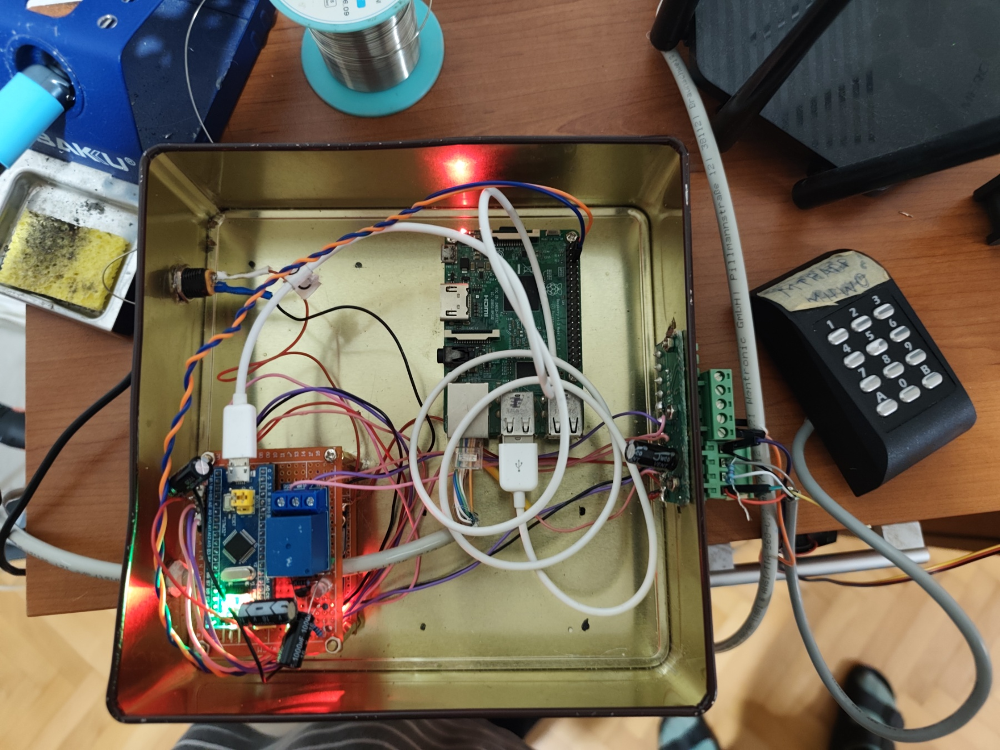

This is the clearest top-down overview of the full test assembly. It shows the open metal enclosure, Raspberry Pi mounted inside the box, STM32 Blue Pill controller plus relay board, side terminal board, and the external keypad reader connected on the right. Use this image as the main reference for the physical test setup when discussing wiring or hardware-induced comms problems.

### Internal Layout And Wiring Density

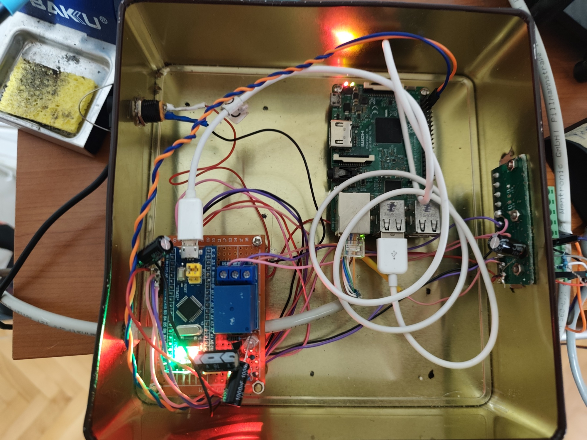

This photo focuses on the inside of the enclosure and makes the wiring density more obvious. It is useful when describing why the prototype is still susceptible to bench-noise, ground-routing, relay, or layout-related issues. It also shows the Raspberry Pi and controller board sharing space inside a conductive enclosure with short internal runs and improvised harnessing.

### Angled View Of Enclosure, Terminal Block, And Keypad

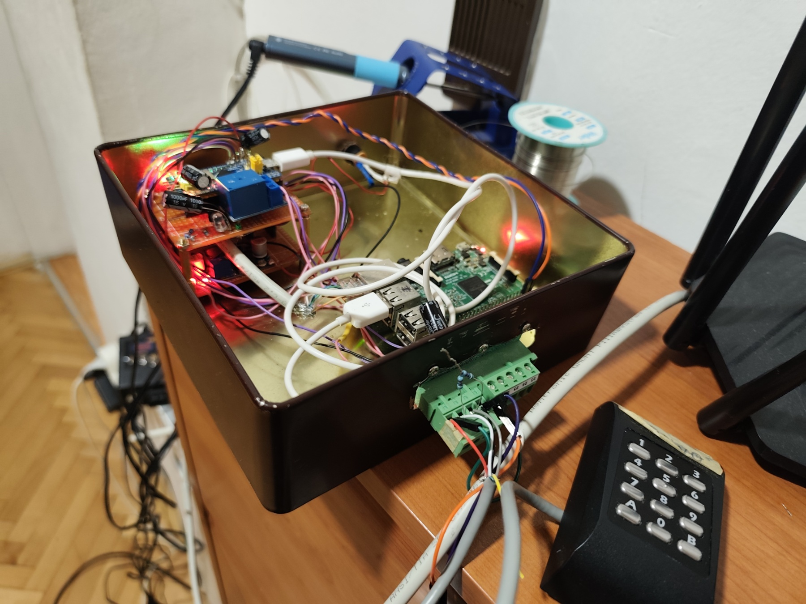

This angle helps explain how the enclosure, external connector area, and keypad are physically arranged on the desk during testing. It is a good image to use when documenting cable exits, field wiring direction, and why mechanical layout may still be part of the debugging story.

### Close View Of Internal Components

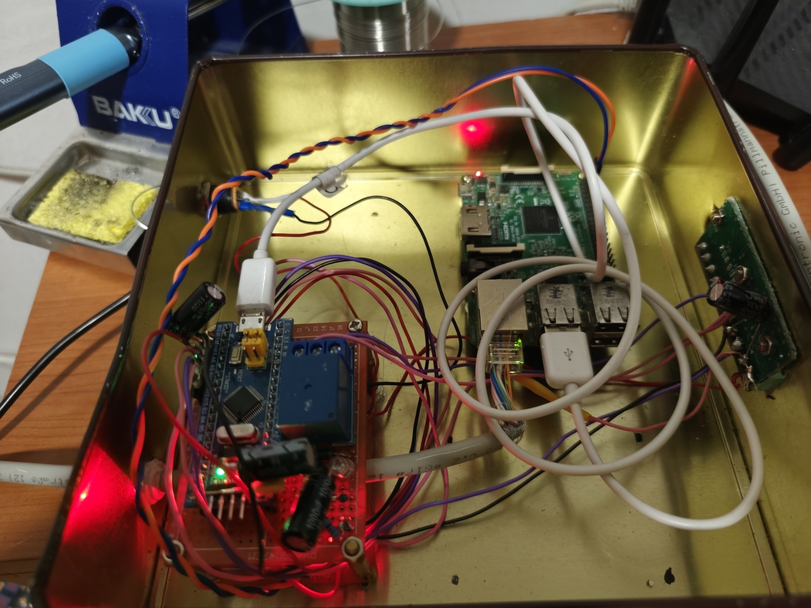

This is the most component-focused photo of the internal build. It gives a clearer view of the Blue Pill controller board, the relay module, the Raspberry Pi, and the side board used for termination or interface wiring. Use it when describing the internal relationship between the control electronics and the relay path.

### Bench Context And Cooling Experiment

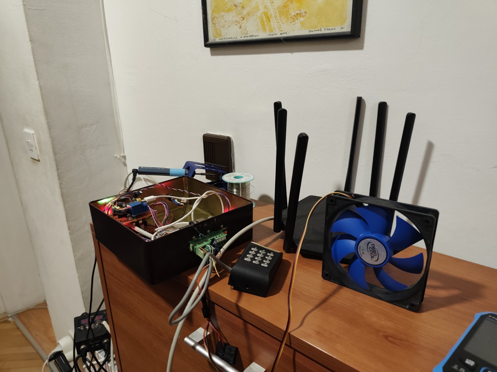

This wide shot captures the full bench context: the enclosure, keypad, nearby router, and the external fan placed beside the setup. It is useful as a documentation image because it shows that the prototype is being tested in an ad hoc lab environment rather than a fixed installation, which matters when discussing repeatability, EMI, wiring stability, and temporary cooling or isolation experiments.

## Web UI Images

Red squares mark the important tabs, buttons, or controls. The numbered lists under each screenshot explain what each marked item means and what it is used for during UI testing.

## Overview Navigation

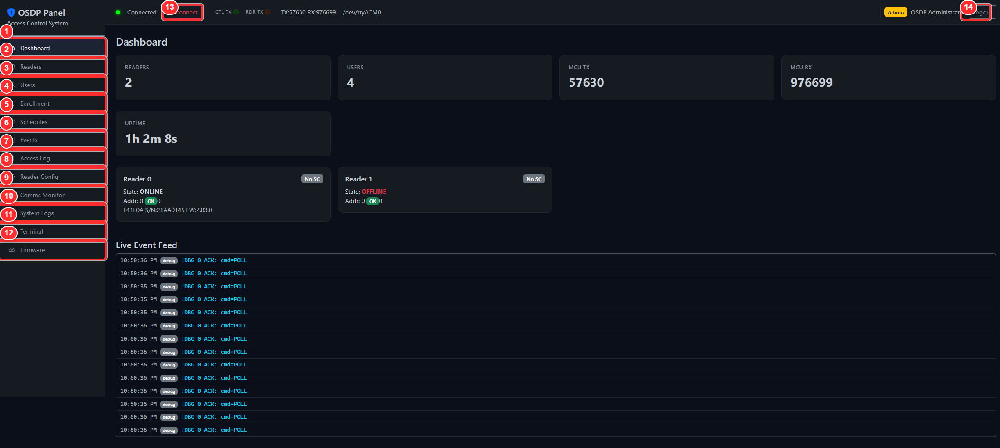

1. `Dashboard`: Summary view for readers, users, controller traffic, uptime, and recent events.
2. `Readers`: Reader inventory and direct status/action commands.
3. `Users`: User records and panel login account management.
4. `Enrollment`: Card and PIN enrollment workflow.
5. `Schedules`: Time windows used by access-control rules.
6. `Events`: Raw event log browser.
7. `Access Log`: Access decision history with refresh support.
8. `Reader Config`: Direct configuration and command console for a selected reader.
9. `Comms Monitor`: Live transport/debug stream with debug toggles.
10. `System Logs`: Backend or system-level operational log view.
11. `Terminal`: Raw command entry against the controller/bridge.
12. `Firmware`: Firmware upload and flash workflow.
13. `Connect` or `Disconnect`: Opens or closes the bridge connection between the panel app and the controller.
14. `Logout`: Ends the authenticated admin session.

## Dashboard

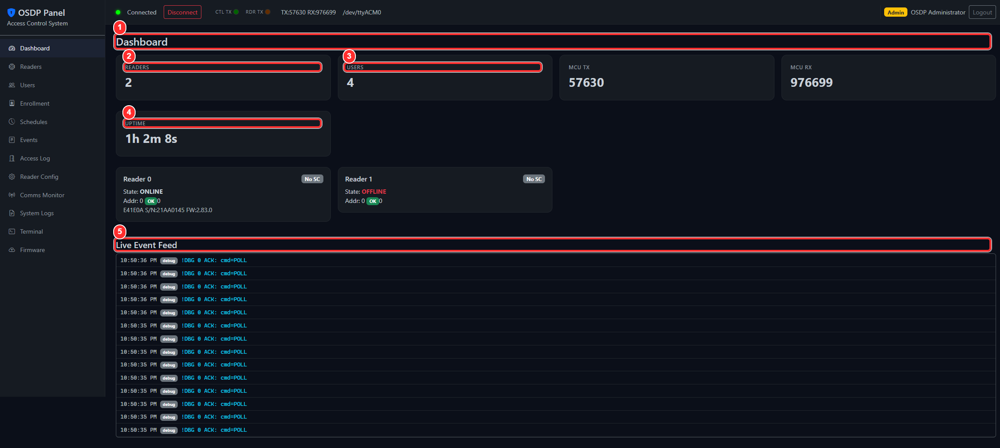

1. `Dashboard` heading: Confirms the active tab and page context.
2. `Readers`: High-level count of configured readers.
3. `Users`: High-level count of configured user records.
4. `Uptime`: Shows panel or backend uptime for quick health checks.
5. `Live Event Feed`: Real-time event stream used to validate card reads, relays, keypad traffic, and state changes.

Testing focus: confirm counts update, uptime is present, and live events move when the controller is active.

## Readers

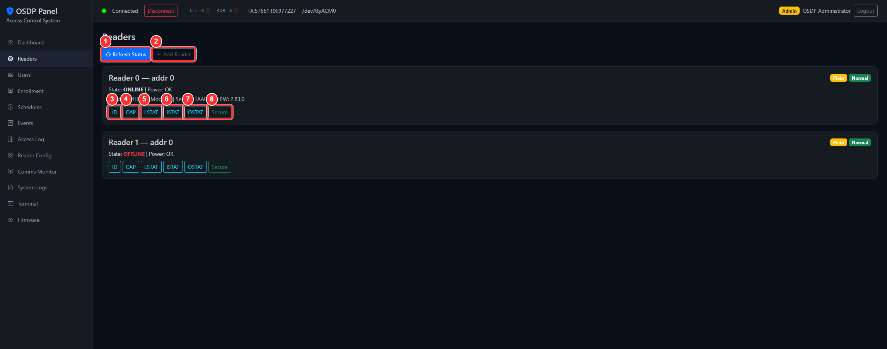

1. `Refresh Status`: Reloads current reader state without leaving the page.
2. `Add Reader`: Starts the workflow for registering another reader.
3. `ID`: Requests reader identity information.
4. `CAP`: Requests the reader capability table.
5. `LSTAT`: Requests local status such as tamper and power state.
6. `ISTAT`: Requests input status.
7. `OSTAT`: Requests output status.
8. `Secure`: Initiates secure-channel setup with the selected reader.

Testing focus: each command should produce visible feedback, status changes, or log output without hanging the page.

## Users

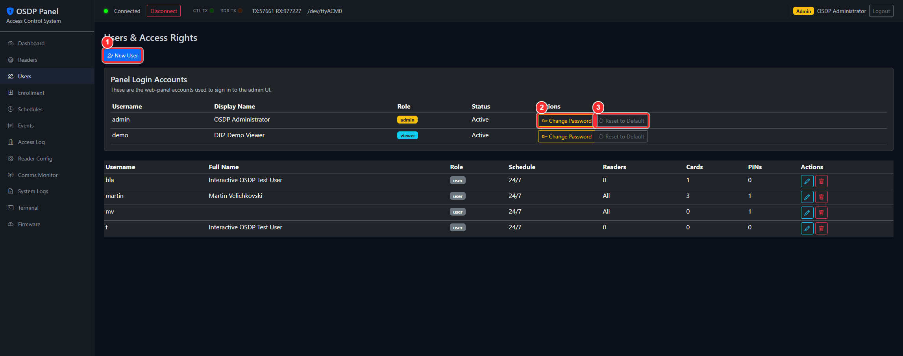

1. `New User`: Creates a new access-control user.
2. `Change Password`: Changes the selected panel account password.
3. `Reset to Default`: Resets a panel account back to its seeded default password.

Testing focus: dialogs or forms should open correctly, validation should be clear, and account changes should persist after refresh.

## Enrollment

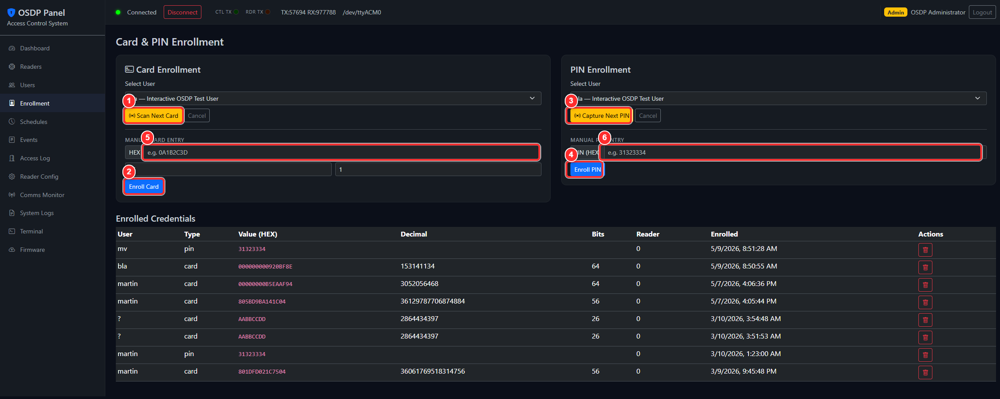

1. `Scan Next Card`: Arms the page to capture the next presented card.
2. `Enroll Card`: Saves the currently captured or manually entered card data.
3. `Capture Next PIN`: Arms the page to capture the next keypad PIN sequence.
4. `Enroll PIN`: Saves the currently captured or manually entered PIN data.
5. Manual card field: Used to type a card value directly when testing without a live swipe.
6. Manual PIN field: Used to type keypad data directly in hex form.

Testing focus: scan/capture should populate fields, cancel paths should reset state, and manual entry should validate format cleanly.

## Schedules

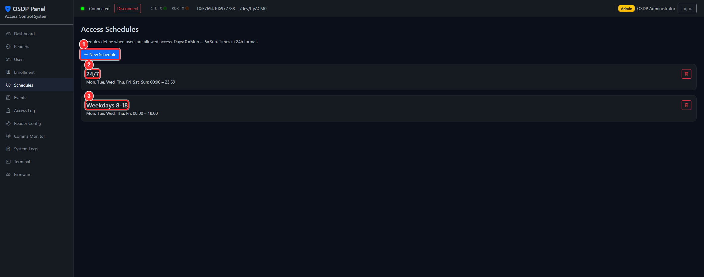

1. `New Schedule`: Creates another schedule record.
2. `24/7`: Example always-on schedule card.
3. `Weekdays 8-18`: Example limited-hours schedule card.

Testing focus: schedule cards should render correctly, edits should be discoverable, and creating a new schedule should not disturb existing entries.

## Events

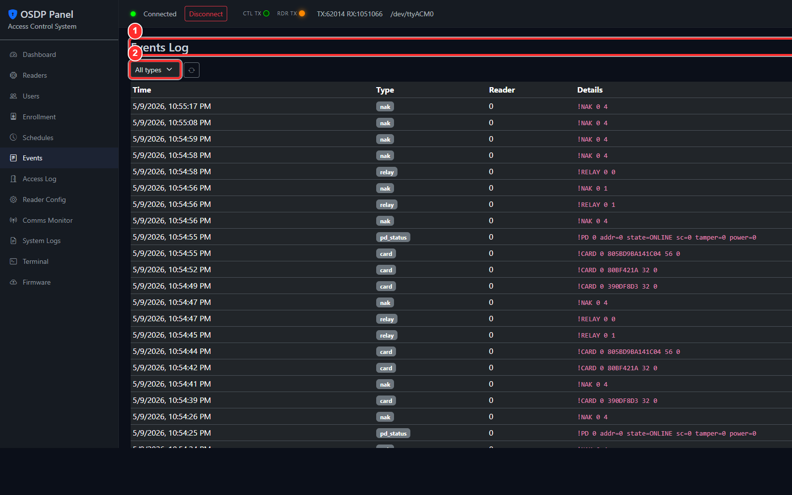

1. `Events Log`: Main page title for the raw event history view.
2. Filter selector: Narrows the event stream by type or category.

Testing focus: filter changes should immediately affect the displayed log without breaking pagination or layout.

## Access Log

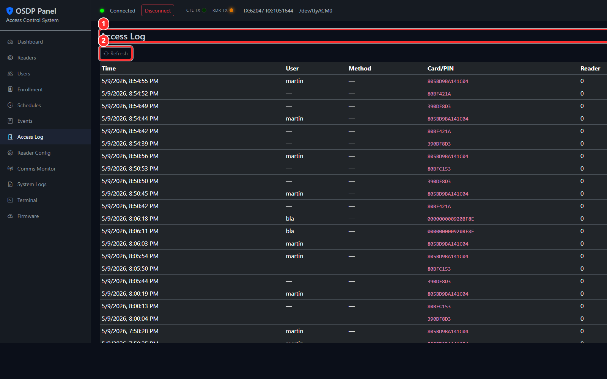

1. `Access Log`: Page title for grant or deny history.
2. `Refresh`: Reloads the latest access decisions.

Testing focus: refresh should show new swipes and decisions, and timestamps or usernames should remain aligned after reload.

## Reader Config

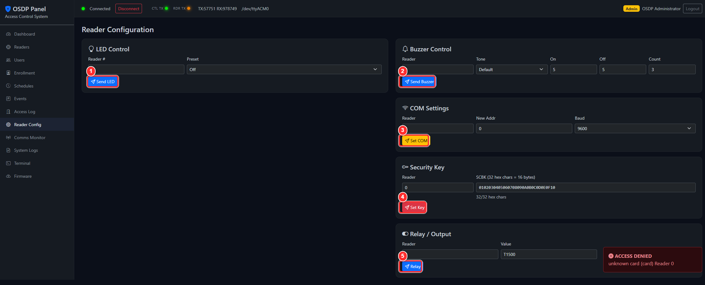

1. `Send LED`: Sends a direct LED command to the reader.
2. `Send Buzzer`: Sends a direct buzzer command.
3. `Set COM`: Pushes communication settings such as address or baud.
4. `Set Key`: Programs or updates the reader key material.
5. `Relay`: Sends a relay or output command.

Testing focus: each command should produce either a visible hardware effect or an immediate result in the comms monitor. This page is the fastest place to test direct reader actions.

## Comms Monitor

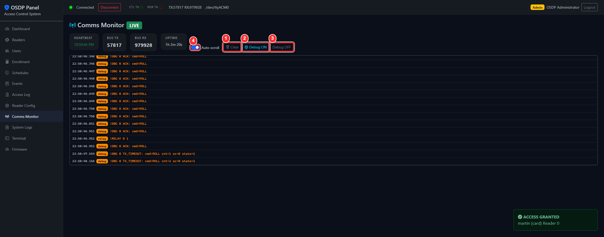

1. `Clear`: Clears the visible monitor output.
2. `Debug ON`: Enables verbose controller debug traffic.
3. `Debug OFF`: Disables verbose controller debug traffic.
4. Checkbox filter: Toggles an additional filtering option for the live monitor stream.

Testing focus: debug toggles should take effect immediately and the monitor should remain readable during heavy traffic.

## System Logs

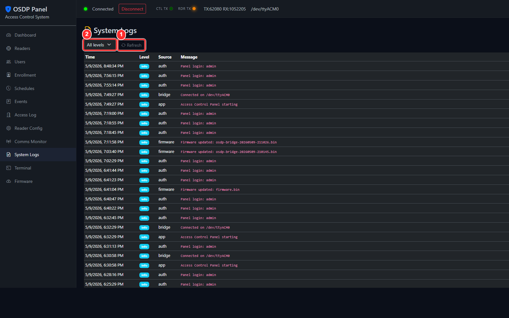

1. `Refresh`: Reloads system log entries.
2. Filter selector: Narrows logs by severity or type.

Testing focus: refresh and filtering should work without duplicating entries or freezing the page.

## Terminal

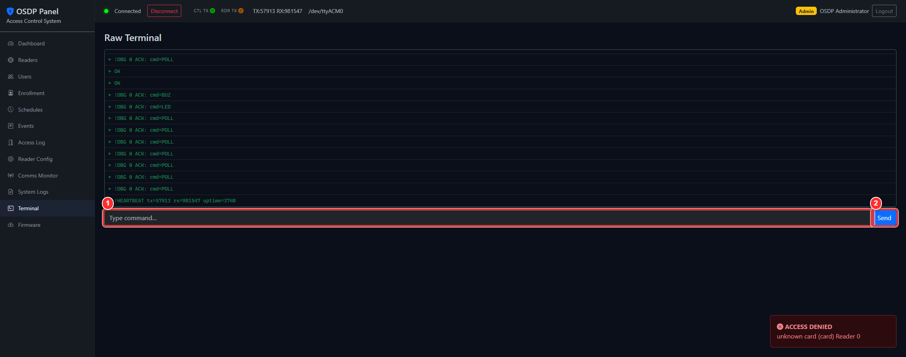

1. Command input: Freeform raw command entry field.
2. `Send`: Submits the typed raw command to the controller or bridge.

Testing focus: commands should echo clearly, errors should be visible, and the terminal should not allow accidental invisible failures.

## Firmware

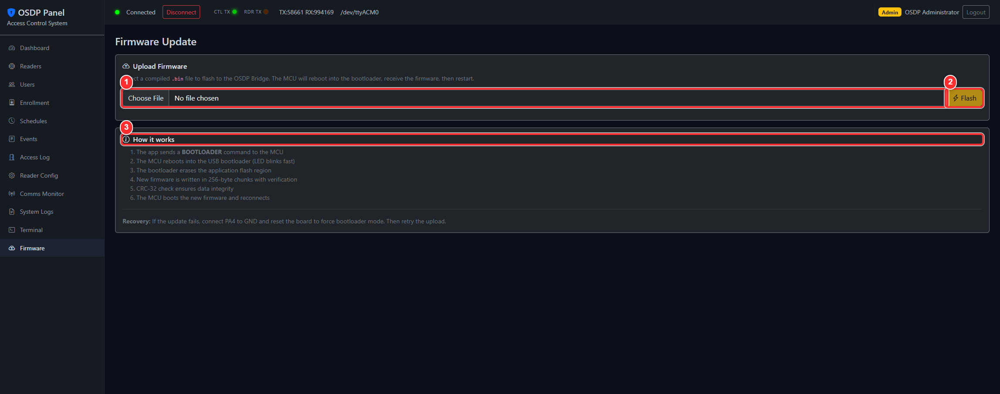

1. `Choose File`: Opens the file picker for a compiled firmware `.bin` image.
2. `Flash`: Starts the firmware upload once a file has been selected.
3. `How it works`: Reference panel that explains the bootloader and flash process.

Testing focus: invalid files should be rejected, progress should be visible during upload, and recovery instructions should remain understandable if flashing fails.

## Suggested UI Test Pass

1. Verify login, bridge connect or disconnect, and logout behavior from the shell controls.
2. Visit every sidebar tab and confirm the heading matches the selected tab.
3. Exercise at least one action button on Readers, Enrollment, Reader Config, Comms Monitor, Terminal, and Firmware.
4. Confirm that log-style pages update without layout breakage: Dashboard, Events, Access Log, System Logs, and Comms Monitor.
5. Check that empty states, disabled buttons, and invalid input handling are understandable to an admin user.
